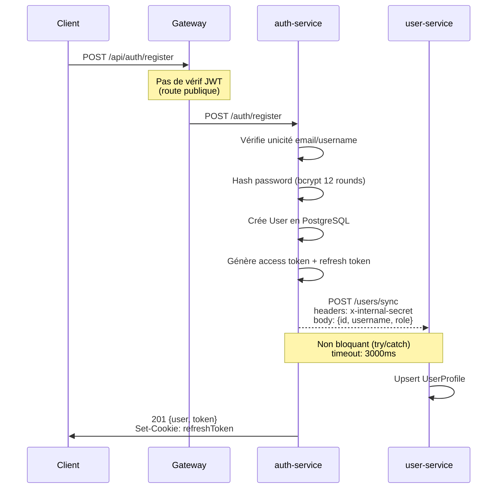
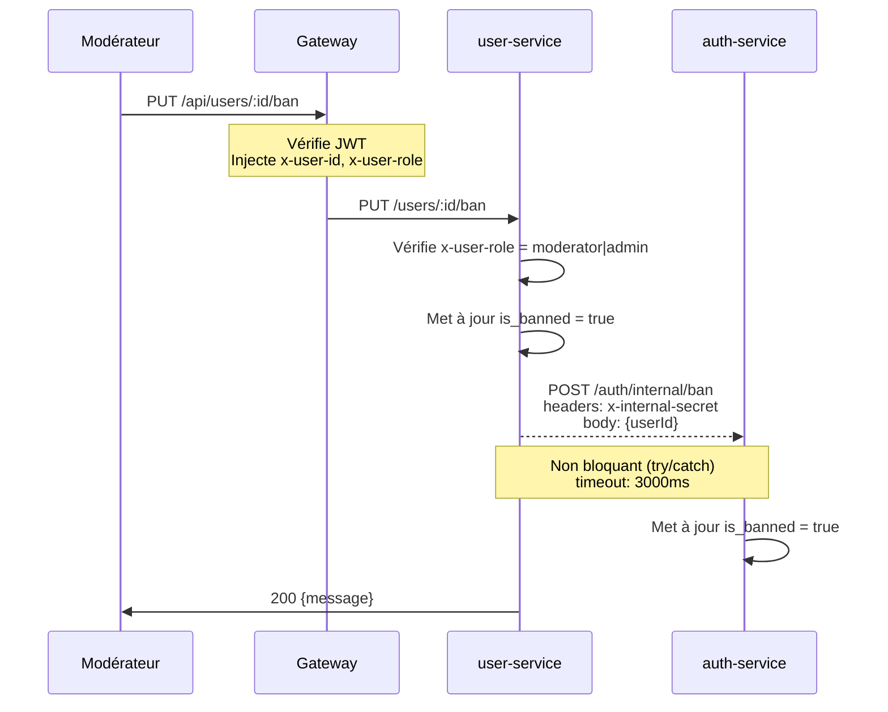
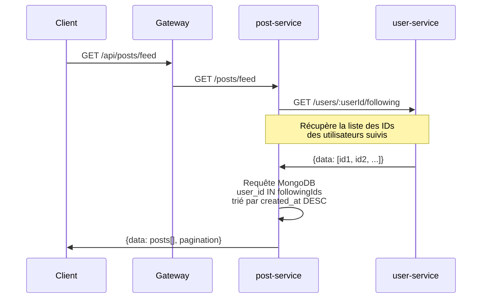
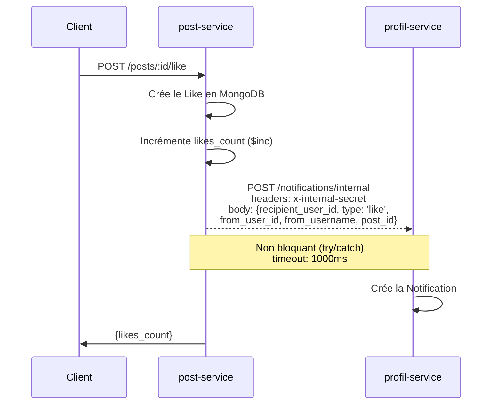

# Communication inter-services

## Vue d'ensemble des flux

Les services Breezy communiquent exclusivement via **HTTP REST synchrone**. Il n'y a pas de message broker (RabbitMQ, Kafka, etc.). Les appels inter-services sont protégés par un `INTERNAL_SECRET` partagé et sont **non bloquants** : si le service cible est indisponible, l'opération principale réussit quand même.

## Flux détaillés

### 1. Inscription — auth-service → user-service

**Fichiers sources :**

- Envoi : `breezy-auth-service/src/controllers/auth.controller.js` (ligne 38-48)
- Réception : `breezy-user-service/src/controllers/user.controller.js` (ligne 8-22)

---

### 2. Bannissement — user-service → auth-service

**Fichiers sources :**

- Envoi : `breezy-user-service/src/controllers/user.controller.js` (ligne 180-210)
- Réception : `breezy-auth-service/src/controllers/auth.controller.js` (ligne 199-221)

---

### 3. Feed — post-service → user-service

**Fichiers sources :**

- Appel : `breezy-post-service/src/controllers/post.controller.js` (ligne 50-84)
- Endpoint appelé : `breezy-user-service/src/controllers/user.controller.js` (ligne 165-177)

!!! warning "Comportement en cas d'erreur"
    Si le user-service est indisponible, le post-service renvoie un **feed vide** (pas une erreur 500). C'est un choix de design : mieux vaut un feed vide qu'une page d'erreur.

---

### 4. Notifications — post-service → profil-service

**Fichiers sources :**

- Envoi : `breezy-post-service/src/controllers/like.controller.js` (ligne 24-35)
- Réception : `breezy-profil-service/src/controllers/notification.controller.js` (ligne 44-55)

!!! note "Auto-notification"
    Le profil-service ne crée pas de notification si `recipient_user_id === from_user_id` (on ne se notifie pas soi-même). Voir ligne 51 de `notification.controller.js`.

---

## Headers utilisés

### Headers injectés par la Gateway

| Header | Description | Exemple |
|--------|-------------|---------|
| `x-user-id` | UUID de l'utilisateur authentifié | `a1b2c3d4-...` |
| `x-user-role` | Rôle de l'utilisateur | `user`, `moderator`, `admin` |

Ces headers sont ajoutés par la Gateway après vérification du JWT (`breezy-infra/gateway/src/middleware/auth.js`). Les services backend ne vérifient **jamais** le JWT eux-mêmes — ils font confiance aux headers de la Gateway.

!!! warning "Sécurité"
    La Gateway ne propage **pas** le header `x-user-username` vers les services backend (seuls `x-user-id` et `x-user-role` sont injectés). Le post-service et le profil-service lisent `x-user-username` directement depuis le header, mais ce header n'est pas injecté par la Gateway actuelle. Cela fonctionne uniquement en mode développement où les headers sont passés directement.

### Header interne

| Header | Description |
|--------|-------------|
| `x-internal-secret` | Secret partagé pour les appels inter-services (variable d'environnement `INTERNAL_SECRET`) |

## Résumé des appels inter-services

| Source | Cible | Route | Méthode | Protection | Timeout |
|--------|-------|-------|---------|------------|---------|
| auth-service | user-service | `/users/sync` | POST | `x-internal-secret` | 3000ms |
| user-service | auth-service | `/auth/internal/ban` | POST | `x-internal-secret` | 3000ms |
| post-service | user-service | `/users/:id/following` | GET | Aucune (interne Docker) | 3000ms |
| post-service | profil-service | `/notifications/internal` | POST | `x-internal-secret` | 1000ms |
