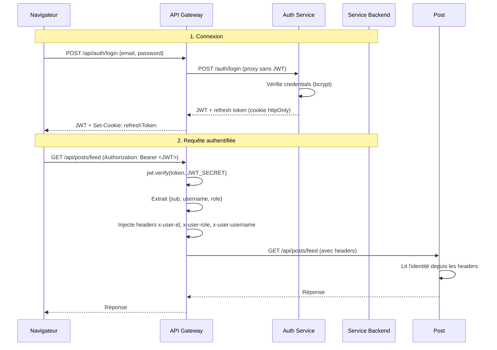
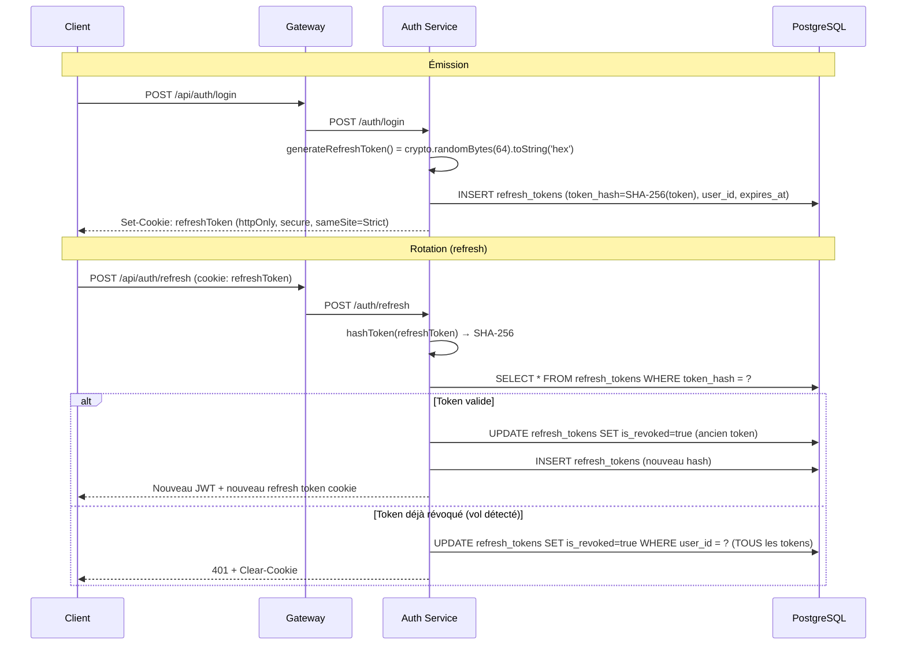
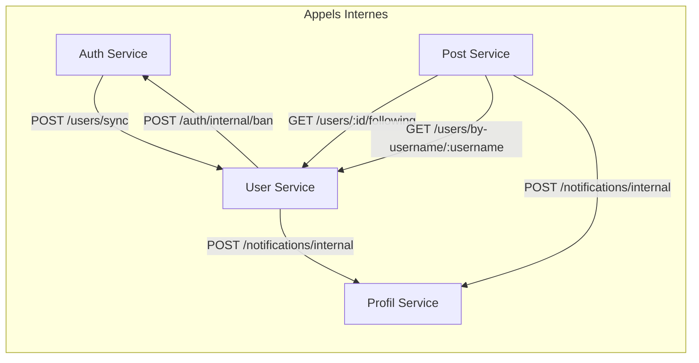

# Communication inter-services

## Architecture de la communication

La communication entre les services Breezy repose sur deux mécanismes distincts :

1. **Authentification utilisateur** : JWT + refresh tokens, vérifié uniquement par l'API Gateway
2. **Communication interne** : Appels HTTP synchrones avec timeout court, protégés par un secret partagé

---

## 1. Authentification JWT

### Flow général



### Génération du JWT (Auth Service)

```javascript
// auth-service/src/utils/jwt.utils.js
const generateAccessToken = (user) =>
  jwt.sign(
    { sub: user.id, username: user.username, role: user.role },
    process.env.JWT_SECRET,
    { expiresIn: process.env.JWT_EXPIRES_IN || '15m' }
  );
```

Le payload du JWT contient :
- `sub` : UUID de l'utilisateur
- `username` : Nom d'utilisateur
- `role` : `user`, `moderator` ou `admin`

### Vérification du JWT (Gateway)

```javascript
// gateway/src/middleware/auth.js
const { verifyToken } = require("../utils/jwt.utils.js");

function authenticate(req, res, next) {
    const authHeader = req.headers['authorization'];
    if (!authHeader) {
        return res.status(401).json({ message: "No token provided" });
    }
    const token = authHeader.split(' ')[1];
    const decoded = verifyToken(token);
    if (!decoded) {
        return res.status(401).json({ message: "Invalid or expired token" });
    }
    req.user = decoded;
    next();
}
```

Le middleware `auth.js` de la Gateway :
1. Extrait le token du header `Authorization: Bearer <token>`
2. Appelle `jwt.verify(token, JWT_SECRET)`
3. Retourne `401` si le token est manquant ou invalide
4. Stocke le payload décodé dans `req.user`
5. Passe au middleware suivant

### Injection des headers d'identité

La Gateway injecte les headers suivants **après** vérification du JWT :

| Header | Source | Routes concernées |
|---|---|---|
| `x-user-id` | `req.user.sub` | Toutes les routes protégées |
| `x-user-role` | `req.user.role` | Toutes les routes protégées |
| `x-user-username` | `req.user.username` | Routes auth/me, auth/change-password, posts, upload, profils, notifications |

**IMPORTANT** : Les routes du User Service (`/api/users`) ne reçoivent **pas** `x-user-username` — seulement `x-user-id` et `x-user-role`.

Les services backend ne vérifient **jamais** le JWT eux-mêmes. Ils lisent l'identité depuis les headers injectés par la Gateway via le middleware `identity.middleware.js` :

```javascript
// auth-service/src/middleware/identity.middleware.js
module.exports = (req, res, next) => {
  const userId = req.headers['x-user-id'];
  const userRole = req.headers['x-user-role'];
  const username = req.headers['x-user-username'];

  if (!userId) {
    return res.status(401).json({
      error: { code: 'MISSING_IDENTITY', message: 'Identité manquante.' }
    });
  }

  req.userId = userId;
  req.userRole = userRole;
  req.username = username;
  next();
};
```

---

## 2. Refresh tokens

### Cycle de vie



### Caractéristiques

- **Génération** : `crypto.randomBytes(64).toString('hex')` (128 caractères hex)
- **Stockage** : Hash SHA-256, jamais en clair en base
- **Expiration** : `REFRESH_TOKEN_DAYS` (défaut : 7 jours)
- **Rotation** : Chaque utilisation révoque l'ancien token et en émet un nouveau
- **Détection de vol** : Si un token révoqué est présenté, **tous** les tokens de l'utilisateur sont révoqués
- **Cookie** : `httpOnly`, `secure` en production, `sameSite: 'Strict'`

---

## 3. Communication inter-services (interne)

Tous les appels inter-services sont :

- **Non bloquants** : timeouts courts (1-3s), les échecs sont loggés mais ne bloquent pas le flux principal
- **Protégés** par le header `x-internal-secret` (même valeur dans tous les services, définie dans `.env`)
- **En HTTP direct** via les noms de conteneur Docker (ex: `http://auth-service:3001`)

### Liste des appels internes



#### 1. Synchronisation d'inscription (Auth → User)

Lors de l'inscription, l'Auth Service notifie le User Service pour créer le profil associé :

```
POST /users/sync
Headers: x-internal-secret: <INTERNAL_SECRET>
Body: {
  "id": "uuid-de-l-utilisateur",
  "username": "john_doe",
  "role": "user"
}
```

- Timeout : 3 secondes
- Échec non bloquant : l'inscription reste valide même si le User Service est indisponible

#### 2. Propagation de bannissement (User → Auth)

Lorsqu'un modérateur ou admin bannit un utilisateur via le User Service, le bannissement est propagé vers l'Auth Service :

```
POST /auth/internal/ban
Headers: x-internal-secret: <INTERNAL_SECRET>
Body: {
  "userId": "uuid-de-l-utilisateur"
}
```

- Timeout : 3 secondes
- Le bannissement local reste appliqué même si l'appel échoue

#### 3. Récupération des abonnements pour le feed (Post → User)

Pour construire le fil d'actualité, le Post Service récupère la liste des utilisateurs suivis :

```
GET /users/:id/following
Headers: x-user-id: <uuid>
```

- Timeout : 3 secondes
- Si le User Service est indisponible, le feed affiche uniquement les posts de l'utilisateur lui-même

#### 4. Résolution username → ID pour les mentions (Post → User)

Pour les mentions `@username`, le Post Service résout le nom d'utilisateur en ID :

```
GET /users/by-username/:username
Headers: x-user-id: <uuid>
```

#### 5. Notification de like (Post → Profil)

```
POST /api/notifications/internal
Headers: x-internal-secret: <INTERNAL_SECRET>
Body: {
  "recipient_user_id": "uuid-du-proprietaire-du-post",
  "type": "like",
  "from_user_id": "uuid-de-l-auteur-du-like",
  "from_username": "john_doe",
  "post_id": "id-du-post"
}
```

- Timeout : 1 seconde
- Échec silencieux : catch vide

#### 6. Notification de mention (Post → Profil)

Même endpoint que le like, avec `type: "mention"` et les mêmes contraintes.

#### 7. Notification de follow (User → Profil)

```
POST /api/notifications/internal
Headers: x-internal-secret: <INTERNAL_SECRET>
Body: {
  "recipient_user_id": "uuid-de-la-personne-suvie",
  "type": "follow",
  "from_user_id": "uuid-du-follower",
  "from_username": "john_doe"
}
```

- Timeout : 1 seconde
- Notification non critique : l'échec n'empêche pas le follow

---

## 4. Mapping des ports Docker

| Service | Hostname Docker | Port interne |
|---|---|---|
| Nginx | `breezy-nginx` | 80 |
| Frontend | `breezy-frontend` | 3000 |
| API Gateway | `breezy-gateway` | 3000 |
| Auth Service | `breezy-auth` | 3001 |
| User Service | `breezy-user` | 3002 |
| Post Service | `breezy-post` | 3003 |
| Profil Service | `breezy-profil` | 3004 |
| PostgreSQL Auth | `breezy-db-pg-auth` | 5432 |
| PostgreSQL Users | `breezy-db-pg-users` | 5432 |
| MongoDB Posts | `breezy-db-mongo-posts` | 27017 |
| MongoDB Profils | `breezy-db-mongo-profils` | 27017 |

Les URLs de service interne utilisent les noms de conteneur Docker (ex: `http://auth-service:3001` dans `.env.example`), mais les services se réfèrent entre eux via ces hostnames Docker (ex: `http://breezy-auth:3001`).

---

## 5. Sécurité des appels internes

### Secret partagé (`INTERNAL_SECRET`)

- Défini une seule fois dans le `.env` de `breezy-infra/`
- Transmis à chaque service via les variables d'environnement Docker
- Vérifié côté récepteur via `req.headers['x-internal-secret'] !== process.env.INTERNAL_SECRET`
- Doit être changé pour la production

### Isolation réseau

- Les services backend ne sont pas exposés à l'extérieur (pas de `ports` dans docker-compose, seulement `expose`)
- Seul le port 80 (Nginx) est accessible depuis l'hôte
- Tous les services sont sur le réseau bridge `breezy-network`

### Timeouts

Tous les appels inter-services ont des timeouts courts pour ne pas bloquer les réponses utilisateur :
- Synchronisation (auth → user) : 3s
- Bannissement (user → auth) : 3s
- Feed (post → user) : 3s
- Notifications (post/profil → profil) : 1s
