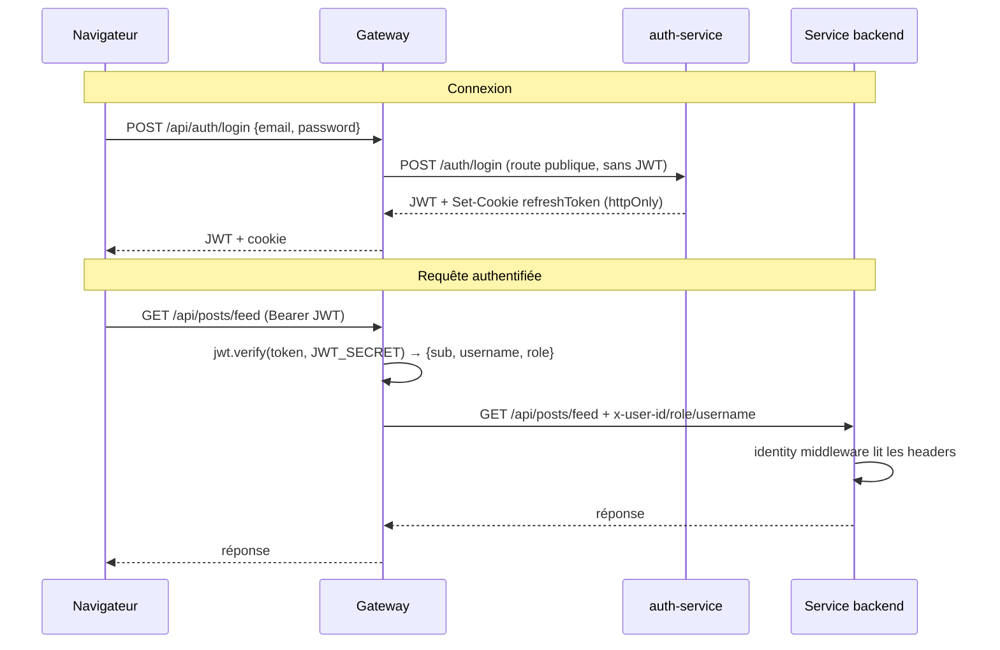
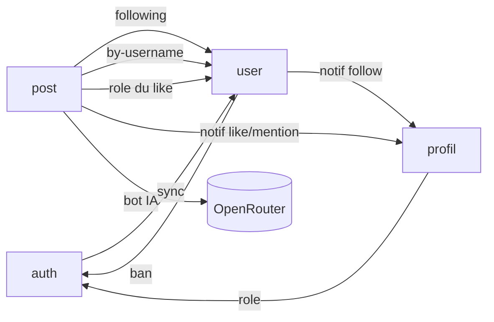

# Communication inter-services

Deux mécanismes coexistent :

1. **Authentification utilisateur** — JWT + refresh tokens, vérifiés **uniquement** par la gateway.
2. **Communication interne** — appels HTTP synchrones, non bloquants, protégés par
   `x-internal-secret`.

---

## 1. Ce que fait la gateway à chaque requête



Pour chaque requête protégée, la gateway :

1. lit `Authorization: Bearer <token>` (sinon `401 No token provided`) ;
2. vérifie la signature (`jwt.verify`) — `401 Invalid or expired token` si KO ;
3. décode `{ sub, username, role }` dans `req.user` ;
4. injecte les headers d'identité ;
5. proxifie vers le service cible.

---

## 2. Headers injectés par la gateway

| Header | Source | Services qui le reçoivent |
|---|---|---|
| `x-user-id` | `req.user.sub` | auth, **user**, post, profil |
| `x-user-role` | `req.user.role` | auth, **user**, post, profil |
| `x-user-username` | `req.user.username` | auth (me, change-password, username, admin), post, profil |

!!! warning "`x-user-username` n'est PAS injecté pour le user-service"
    Les routes `/api/users/*` ne reçoivent que `x-user-id` et `x-user-role`. Le middleware
    `identity` du user-service lit alors `req.username = undefined`. Impact concret : la
    notification de follow part avec `from_username: undefined`.

Côté service, le middleware d'identité **ne vérifie aucun JWT** :

```javascript
// <service>/src/middleware/identity.middleware.js
module.exports = (req, res, next) => {
  const userId = req.headers['x-user-id'];
  if (!userId) return res.status(401).json({ error: { code: 'MISSING_IDENTITY', message: 'Identité manquante.' } });
  req.userId   = userId;
  req.userRole = req.headers['x-user-role'];
  req.username = req.headers['x-user-username'];
  next();
};
```

!!! danger "Confiance aveugle envers les headers"
    Les services font confiance aux `x-user-*` sans vérifier qu'ils proviennent de la gateway.
    Un appel direct à un service (en contournant la gateway) permettrait d'usurper n'importe
    quelle identité. La seule protection actuelle est l'**isolation réseau** : aucun service
    backend ne publie de port (seul Nginx est exposé).

---

## 3. Tous les appels inter-services

| Appelant | Cible | Endpoint | Quand | Authentification | Timeout |
|---|---|---|---|---|---|
| auth | user | `POST /users/sync` | inscription, change-username, admin create | `x-internal-secret` | 3 s |
| user | auth | `POST /auth/internal/ban` | bannissement | `x-internal-secret` | 3 s |
| user | profil | `POST /api/notifications/internal` | follow | `x-internal-secret` | 1 s |
| post | user | `GET /users/:id/following` | feed | `x-user-id` | 3 s |
| post | user | `GET /users/by-username/:username` | mention `@user` | `x-user-id` | défaut |
| post | user | `GET /users/:id` | like (rôle du destinataire) | `x-user-id` | 1 s |
| post | profil | `POST /api/notifications/internal` | like, mention | `x-internal-secret` | 1 s |
| profil | auth | `GET /auth/internal/users/:id/role` | filtrage notif like/follow | `x-internal-secret` | 2 s |
| post | OpenRouter (externe) | `POST /chat/completions` | mention `@breezy_ai` | `Authorization: Bearer` | 15 s |



!!! tip "Détection de vol côté refresh"
    Le cycle de vie du refresh token (rotation + révocation massive sur rejeu) est détaillé dans
    [Authentification](../securite/authentification.md).

---

## 4. Communication interne vs externe

| Aspect | Externe (client → gateway) | Interne (service → service) |
|---|---|---|
| Authentification | JWT (Bearer) | `x-internal-secret` (ou `x-user-id` transmis) |
| Vérification | Gateway (`jwt.verify`) | Comparaison inline dans le contrôleur |
| Réseau | via Nginx (port 80 public) | DNS Docker interne, aucun port public |
| Tolérance aux pannes | erreur visible (502 si backend down) | non bloquant (échec loggé, opération principale OK) |

### Stratégie « fire-and-forget »

Tous les appels internes sont conçus pour ne **jamais** bloquer le flux principal :

- user-service indisponible au feed → liste de following vide (l'utilisateur voit ses propres posts) ;
- user-service indisponible à l'inscription → compte créé, sync différé (warning) ;
- profil-service indisponible à un like → like enregistré, notification perdue ;
- auth-service indisponible à un ban → ban local appliqué, propagation différée.

Ce découplage évite les pannes en cascade, au prix d'une **cohérence éventuelle** (compteurs,
notifications manquantes).

---

## 5. Sécurité des appels internes

- **`INTERNAL_SECRET`** : même valeur dans les 4 microservices (injectée par docker-compose).
  La **gateway ne le reçoit pas** : elle ne fait jamais d'appel interne authentifié par secret.
- Vérifié côté récepteur : `req.headers['x-internal-secret'] !== process.env.INTERNAL_SECRET → 401`.
- **Jamais exposé au client** : la gateway ne transmet pas ce header.

!!! warning "Headers non signés"
    Ni `x-user-*` ni `x-internal-secret` ne sont signés. Un service compromis pourrait forger
    l'identité d'un autre. Pistes d'amélioration : JWT interne signé (HMAC) pour les appels
    service-à-service. Voir [Limites & évolutions](../soutenance/limites.md).
