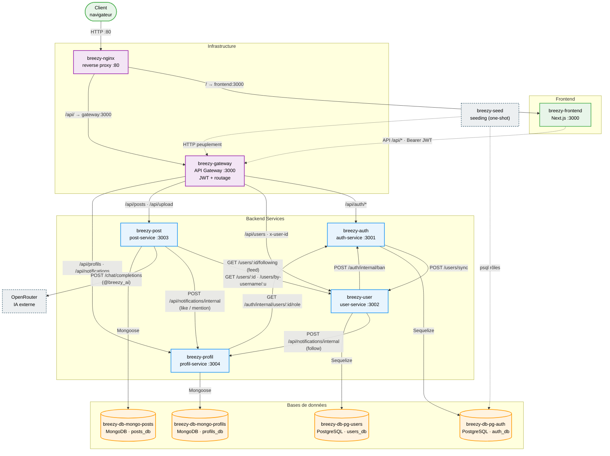

# Diagramme de composants UML

Cette page présente l'architecture de **Breezy** sous forme de diagramme de
composants UML, généré à partir du **code réel** des services. Chaque relation
représentée est prouvée par une référence `fichier:ligne`
(voir le rapport `diagrams/ANALYSE_DEPENDANCES.md` à la racine du dépôt).

Les noms des composants correspondent exactement aux noms des **containers**
définis dans `breezy-infra/docker-compose.yml`.

## Vue complète

Le diagramme ci-dessous montre l'ensemble des composants (frontend,
infrastructure, microservices, bases de données), leurs interfaces principales
et toutes les dépendances réelles entre eux.

> Une version PlantUML équivalente (`diagrams/composants.puml`) et une version
> simplifiée pour la soutenance (`diagrams/composants-simplifie.mmd`) sont
> disponibles à la racine du dépôt.

## Légende

| Couleur / Style | Zone |
|-----------------|------|
| 🟪 Violet | Infrastructure (`breezy-nginx`, `breezy-gateway`) |
| 🟦 Bleu | Microservices backend (`auth`, `user`, `post`, `profil`) |
| 🟧 Orange (cylindre) | Bases de données (PostgreSQL / MongoDB) |
| 🟩 Vert | Frontend & Client |
| ⬜ Gris pointillé | Composants externes / one-shot (OpenRouter, seed) |
| Flèche pleine `→` | Appel HTTP synchrone / persistance |
| Flèche pointillée `-.->` | Flux indirect (via proxy) ou tâche ponctuelle |

## Relations inter-services

Toutes ces relations sont des appels HTTP **non bloquants**
(`try/catch` + timeout) : une cible indisponible n'échoue jamais la requête
utilisateur principale.

| Source | Destination | Type | Description | Réf. code |
|--------|-------------|------|-------------|-----------|
| auth-service | user-service | Synchrone HTTP | `POST /users/sync` — réplique le profil après register / changement de username / création admin | auth.controller.js:38, 247, 299 |
| user-service | auth-service | Synchrone HTTP | `POST /auth/internal/ban` — propagation du bannissement vers la source de vérité | user.controller.js:229 |
| user-service | profil-service | Synchrone HTTP | `POST /api/notifications/internal` — notification de *follow* | user.controller.js:106 |
| post-service | user-service | Synchrone HTTP | `GET /users/:id/following` (feed), `GET /users/:id` (rôle au like), `GET /users/by-username/:u` (mention) | post.controller.js:163, 77 · like.controller.js:27 |
| post-service | profil-service | Synchrone HTTP | `POST /api/notifications/internal` — notifications de *like* et de *mention* | like.controller.js:34 · post.controller.js:84 |
| profil-service | auth-service | Synchrone HTTP | `GET /auth/internal/users/:id/role` — vérifie le rôle du destinataire avant de créer la notif | notification.controller.js:75 |
| post-service | OpenRouter | Synchrone HTTP (externe) | `POST /api/v1/chat/completions` — réponse IA `@breezy_ai` | post.controller.js:12 |

## Interfaces internes vs externes

### Interfaces publiques (accessibles via le gateway, JWT requis)

Le frontend ne parle **qu'au gateway** (`/api/*`, `src/services/api.js:6`). Le
gateway valide le JWT une seule fois (`gateway/src/middleware/auth.js`) puis
injecte `x-user-id` / `x-user-role` / `x-user-username` vers les services.

- **auth** : `/api/auth/register`, `/login`, `/refresh`, `/logout`, `/me`,
  `/change-password`, `/username`, `/admin/create-user`
- **user** : `/api/users/:id`, `/search`, `/:id/follow`, `/:id/followers`,
  `/:id/following`, `/:id/ban`, `/by-username/:username`
- **post** : `/api/posts` (CRUD), `/feed`, `/search`, `/:id/like`, `/:id/repost`,
  `/:id/comments`, `/user/:userId/*`, `/api/upload`
- **profil** : `/api/profils/:userId`, `/api/notifications`,
  `/api/notifications/read-all`, `/api/notifications/:id/read`

### Interfaces internes (protégées par `INTERNAL_SECRET`, hors gateway)

Appelées **uniquement de service à service** via l'en-tête `x-internal-secret` ;
elles ne sont pas exposées par le gateway.

| Interface | Service | Appelée par |
|-----------|---------|-------------|
| `POST /users/sync` | user-service | auth-service |
| `POST /auth/internal/ban` | auth-service | user-service |
| `GET /auth/internal/users/:id/role` | auth-service | profil-service |
| `POST /api/notifications/internal` | profil-service | user-service, post-service |

---

*Diagramme généré par analyse du code source (6 services analysés en parallèle).
Voir `diagrams/ANALYSE_DEPENDANCES.md` pour la matrice de dépendances, l'analyse
de couplage, les SPOF et les recommandations.*
