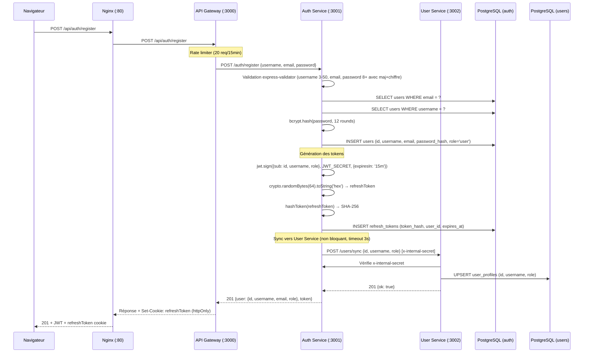
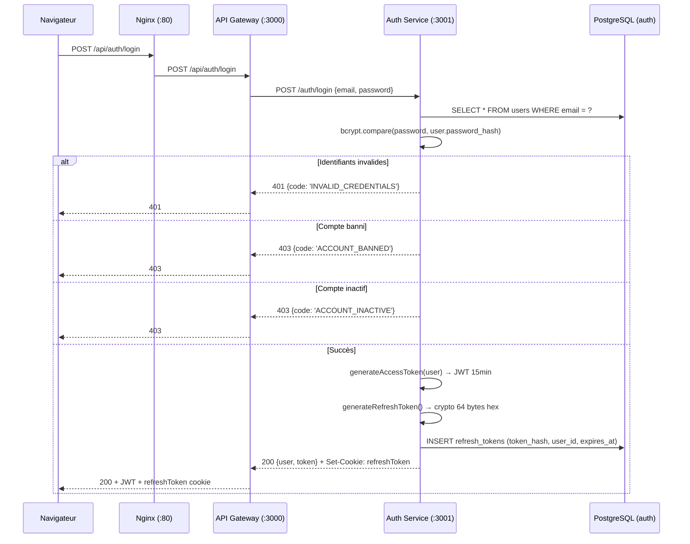
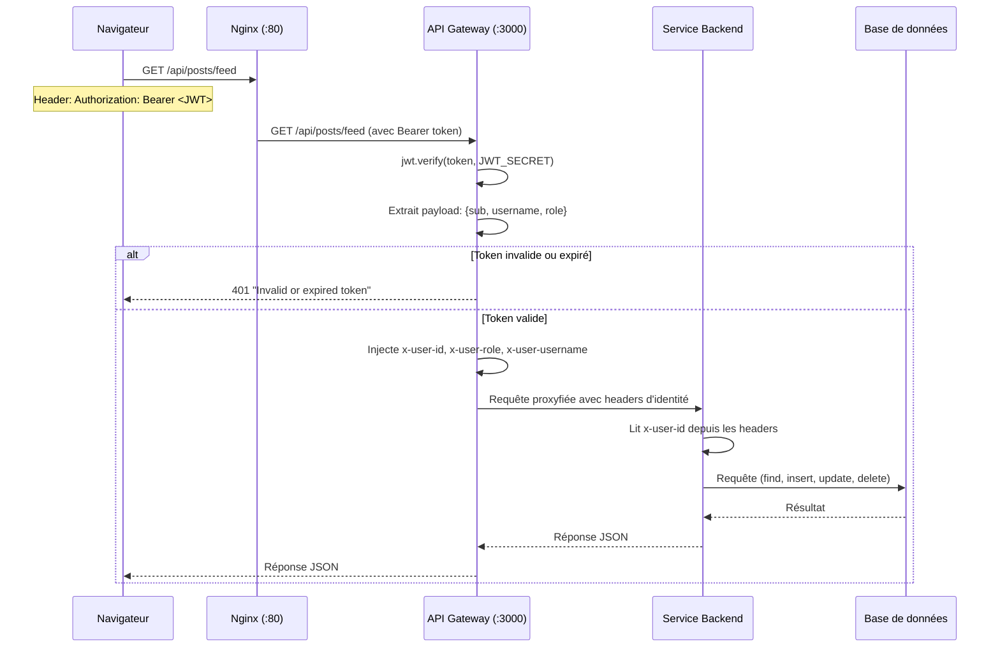
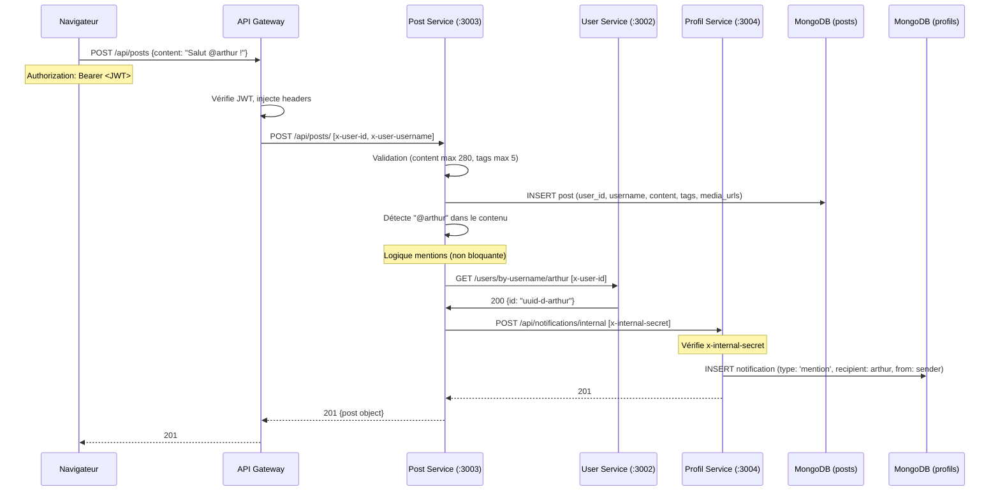
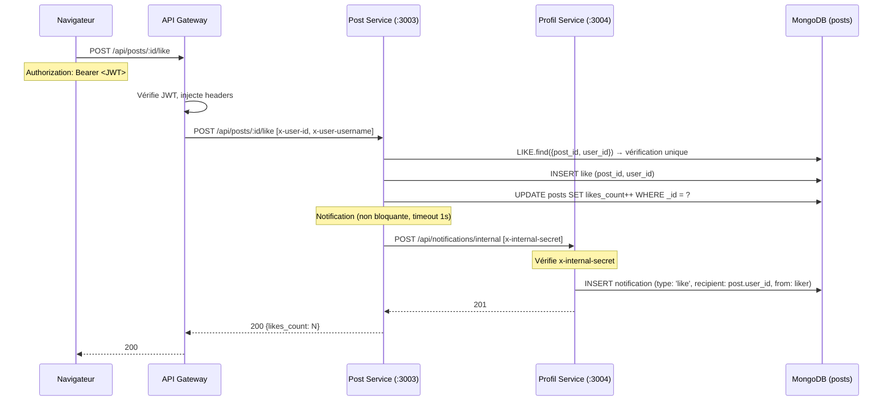
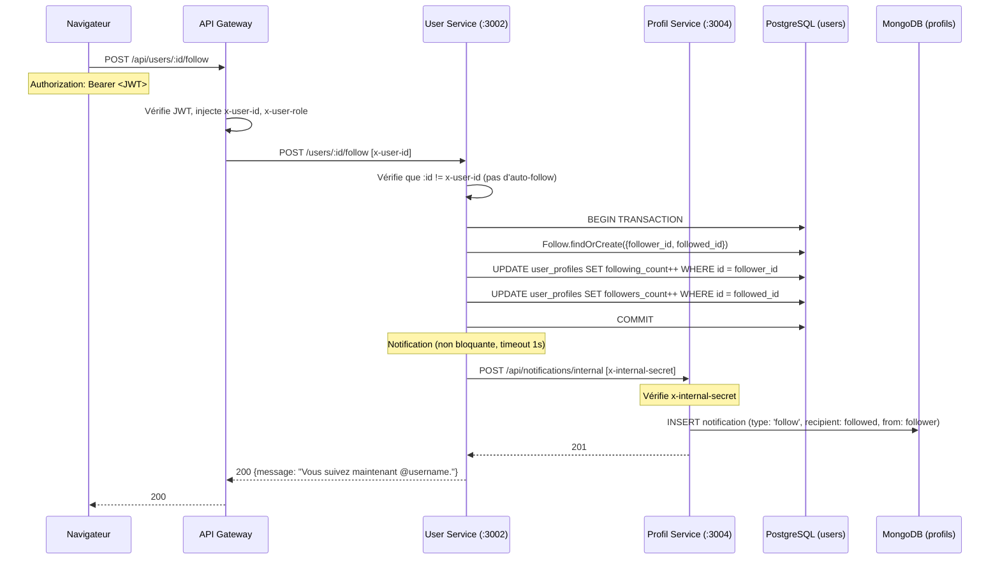
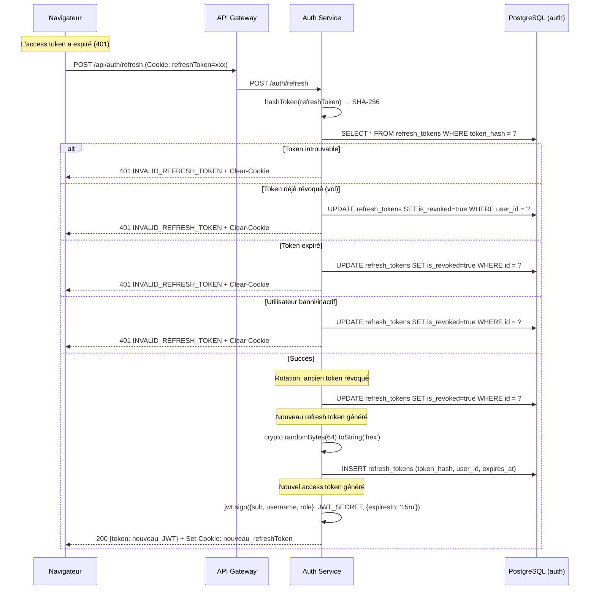
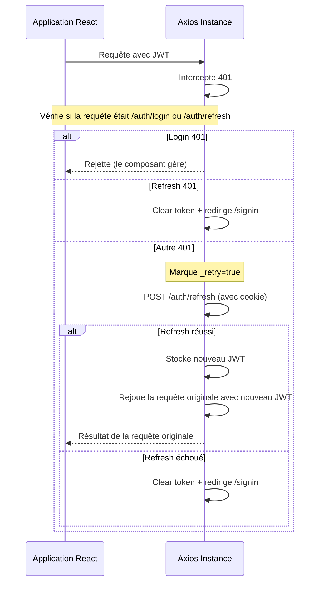

# Flux de données

Cette page détaille les principaux flux de données dans Breezy, du navigateur jusqu'aux bases de données.

---

## 1. Inscription complète

**Points clés :**
- Validation stricte : username 3-50 caractères (lettres, chiffres, underscores), email valide, password 8+ avec majuscule et chiffre
- UUID v4 généré automatiquement par Sequelize pour l'ID utilisateur
- Le refresh token est émis en cookie `httpOnly` (pas accessible en JavaScript)
- L'appel au User Service est non bloquant : si le service est down, l'inscription réussit quand même

---

## 2. Connexion

---

## 3. Requête authentifiée typique

**Détail des headers injectés par route :**

| Route | Headers injectés |
|---|---|
| `/api/auth/me` | `x-user-id`, `x-user-role`, `x-user-username` |
| `/api/auth/change-password` | `x-user-id`, `x-user-role`, `x-user-username` |
| `/api/users/*` | `x-user-id`, `x-user-role` (pas de username) |
| `/api/posts/*` | `x-user-id`, `x-user-role`, `x-user-username` |
| `/api/upload` | `x-user-id`, `x-user-role`, `x-user-username` |
| `/api/profils/*` | `x-user-id`, `x-user-role`, `x-user-username` |
| `/api/notifications/*` | `x-user-id`, `x-user-role`, `x-user-username` |

---

## 4. Création de post avec mention @

**Caractéristiques :**
- La détection des mentions se fait par regex `@([a-zA-Z0-9_]+)` sur le contenu
- Chaque mention résout le username via User Service
- Le timeout de l'appel mention est de 1 seconde
- Les échecs sont silencieusement ignorés (le post est publié même si les notifications échouent)
- Les auto-mentions sont ignorées (on ne se notifie pas soi-même)

---

## 5. Like avec notification

**En cas de doublon :**
- MongoDB renvoie une erreur `11000` (index unique `{post_id, user_id}`)
- Le service retourne `409 ALREADY_LIKED`

---

## 6. Follow avec notification

**Cas particuliers :**
- Auto-follow : `400 CANNOT_SELF_FOLLOW`
- Double follow : `409 ALREADY_FOLLOWING` (vérifié par la transaction + findOrCreate)
- Cible inexistante : `404 USER_NOT_FOUND`
- Unfollow : `DELETE /users/:id/follow` → `204` (succès) ou `404 NOT_FOLLOWING`

---

## 7. Rafraîchissement de token (refresh)

---

## 8. Refresh token côté frontend

Le mécanisme implémente un `failedQueue` : si plusieurs requêtes échouent simultanément avec 401, une seule tentative de refresh est effectuée, et les autres requêtes sont mises en attente puis rejouées avec le nouveau token.
