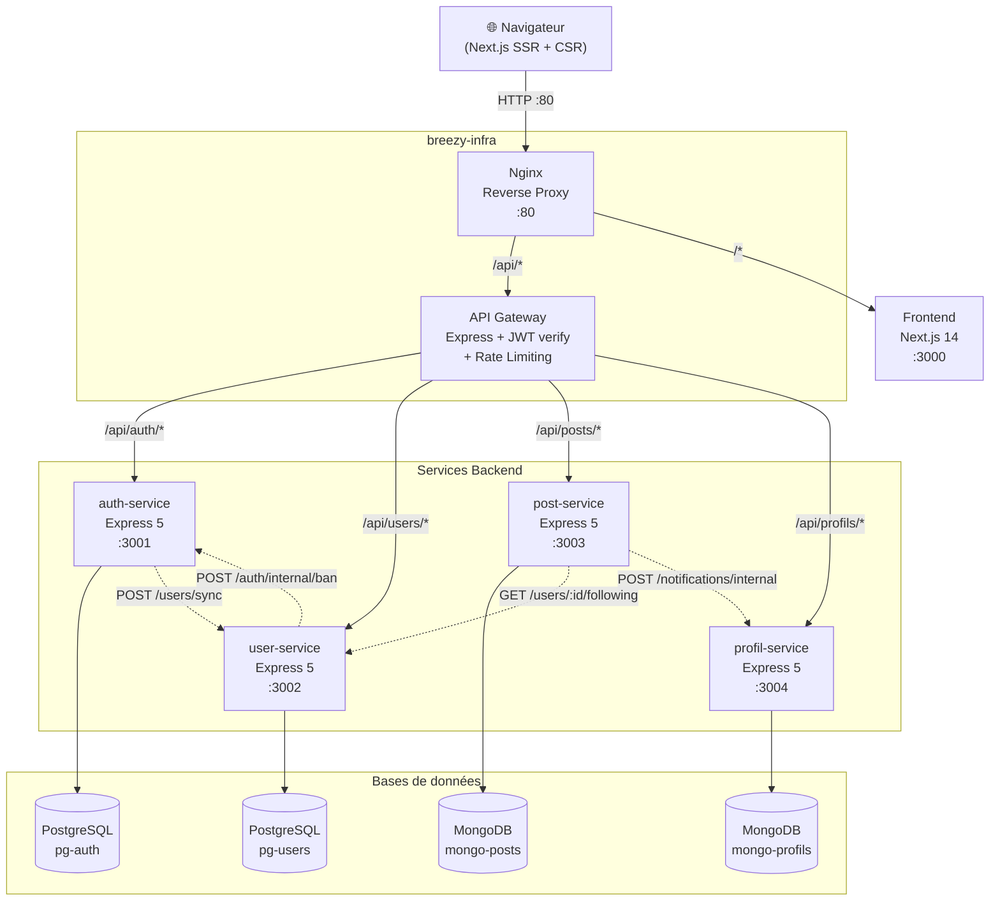

# Vue d'ensemble de l'architecture

Breezy utilise une architecture **microservices** avec 4 services backend indépendants, un API Gateway centralisé, un reverse proxy Nginx et un frontend Next.js.

## Schéma d'architecture

## Rôle de chaque composant

### Nginx (reverse proxy)

- Point d'entrée unique sur le port **80**
- Route `/api/*` vers la **Gateway** (port 3000 interne)
- Route `/*` vers le **Frontend** Next.js (port 3000 interne)
- Rate limiting configuré : 30 req/min global, 5 req/min sur `/api/auth`
- Timeouts proxy : 30 secondes

(`breezy-infra/nginx/nginx.conf`)

### API Gateway

- Vérifie le JWT sur les routes protégées (`/api/users`, `/api/posts`, `/api/profils`)
- Laisse passer `/api/auth` sans vérification JWT (routes publiques)
- Injecte les headers `x-user-id` et `x-user-role` vers les services backend
- Rate limiting applicatif : 100 req/15min global, 10 req/15min sur auth
- Proxy via `http-proxy-middleware`

(`breezy-infra/gateway/src/index.js`)

### auth-service

- Inscription, connexion, refresh token, logout
- Hachage bcrypt des mots de passe (12 rounds par défaut)
- Génération et vérification des JWT
- Stockage des refresh tokens hashés (SHA-256) en PostgreSQL
- Route interne pour bannir un utilisateur (protégée par `INTERNAL_SECRET`)
- Synchronisation du profil vers le user-service à l'inscription

(`breezy-auth-service/`)

### user-service

- Profils publics (username, rôle, compteurs followers/following)
- Follow/unfollow avec compteurs atomiques (transactions Sequelize)
- Recherche utilisateurs (insensible à la casse, exclut bannis/inactifs)
- Modération : bannissement avec propagation vers l'auth-service
- Route interne `/users/sync` pour recevoir les nouveaux comptes

(`breezy-user-service/`)

### post-service

- Création de posts (280 caractères max, tags, media_urls)
- Feed basé sur les abonnements (appel au user-service pour récupérer les IDs suivis)
- Likes avec compteur atomique (`$inc` MongoDB)
- Commentaires avec réponses (profondeur max : 1 niveau)
- Signalement de posts
- Notifications de likes envoyées au profil-service

(`breezy-post-service/`)

### profil-service

- Profil étendu (display_name, bio 160 chars max, avatar_url, banner_url)
- Système de notifications (like, follow, mention, comment, reply)
- Route interne pour créer des notifications depuis les autres services

(`breezy-profil-service/`)

### Frontend

- Next.js 14 avec App Router et route groups `(auth)` / `(app)`
- Tailwind CSS pour le styling
- Système de mocks pour le développement sans backend (`NEXT_PUBLIC_USE_MOCKS=true`)
- Gestion du JWT via `localStorage` + `AuthContext`
- Intercepteur Axios avec redirection automatique sur 401

(`breezy-frontend/`)

## Principes d'architecture

1. **Base de données par service** : chaque service possède sa propre BDD, jamais d'accès direct à la BDD d'un autre service
2. **Communication synchrone** : les services communiquent via HTTP/REST (pas de message broker)
3. **Appels inter-services non bloquants** : si un service appelé est indisponible, l'opération principale n'échoue pas (pattern fail-safe)
4. **Authentification centralisée** : le JWT est vérifié par la Gateway, les services reçoivent l'identité via les headers `x-user-id` / `x-user-role`
5. **Routes internes** : protégées par un `INTERNAL_SECRET` partagé (header `x-internal-secret`), pas par JWT
