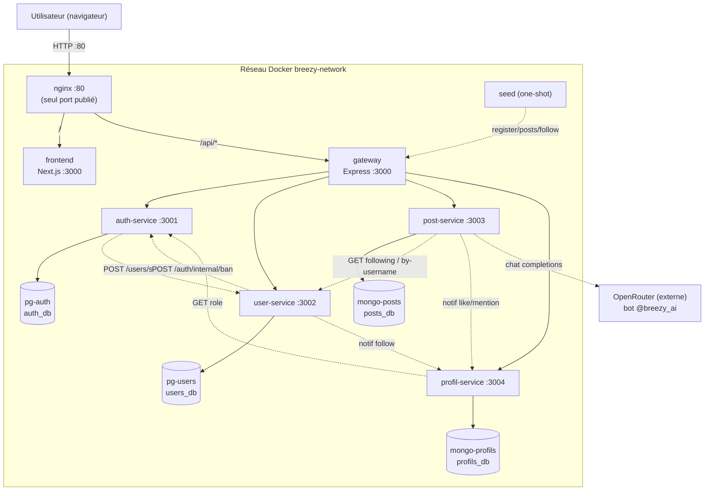

# Vue d'ensemble de l'architecture

Breezy est un réseau social en **architecture microservices** : 4 services métier, une gateway,
un frontend, un reverse proxy et 4 bases de données, soit **12 conteneurs** sur un unique réseau
bridge `breezy-network`.

---

## Diagramme d'ensemble

---

## Couches

| Couche | Composant | Rôle |
|---|---|---|
| **Client** | Navigateur | SPA Next.js servie par Nginx |
| **Proxy** | `nginx` | `/api/*` → gateway, `/*` → frontend ; seul port public (`80:80`) |
| **UI** | `frontend` | Next.js App Router, consomme `/api` |
| **Gateway** | `gateway` | Vérifie le JWT, injecte l'identité, rate limiting, proxy |
| **Services** | auth, user, post, profil | Logique métier, chacun avec sa base |
| **Données** | 2× PostgreSQL, 2× MongoDB | Persistance isolée par service |
| **Outillage** | `seed` | Peuplement initial (one-shot) |

---

## Services & ports

| Conteneur | DNS interne | Port interne | Port hôte | Technologie | Base |
|---|---|---|---|---|---|
| `breezy-nginx` | `nginx` | 80 | **80:80** | nginx:alpine | — |
| `breezy-frontend` | `frontend` | 3000 | — | Next.js 14.2 | — |
| `breezy-gateway` | `gateway` | 3000 | — | Express 4.19 | — |
| `breezy-auth` | `auth-service` | 3001 | — | Express 5.2.1 | `auth_db` (PG 15) |
| `breezy-user` | `user-service` | 3002 | — | Express 5.2.1 | `users_db` (PG 15) |
| `breezy-post` | `post-service` | 3003 | — | Express 5.2.1 | `posts_db` (Mongo 6) |
| `breezy-profil` | `profil-service` | 3004 | — | Express 5.2.1 | `profils_db` (Mongo 6) |
| `breezy-db-pg-auth` | `pg-auth` | 5432 | — | PostgreSQL 15-alpine | — |
| `breezy-db-pg-users` | `pg-users` | 5432 | — | PostgreSQL 15-alpine | — |
| `breezy-db-mongo-posts` | `mongo-posts` | 27017 | — | MongoDB 6 | — |
| `breezy-db-mongo-profils` | `mongo-profils` | 27017 | — | MongoDB 6 | — |
| `breezy-seed` | `seed` | — | — | Node 20 + psql | via gateway + pg-auth |

!!! note "Service discovery"
    Les services se résolvent par leur **nom de service docker-compose** (DNS interne du réseau
    bridge) : `http://auth-service:3001`, `http://user-service:3002`, etc. Les `container_name`
    (`breezy-*`) servent surtout aux commandes `docker exec`. L'isolation est assurée par
    l'absence de port publié (sauf Nginx).

---

## Rôle de chaque service

| Service | Responsabilités |
|---|---|
| **Gateway** | Point d'entrée unique, vérification JWT, injection `x-user-*`, rate limiting, proxy, 502 si backend down |
| **Auth** | Inscription, connexion, JWT + refresh (rotation/détection de vol), change-password, change-username, admin create-user, ban interne, role interne |
| **User** | Profils publics, follow/unfollow (transactions + compteurs), recherche, résolution username, bannissement (propagation auth) |
| **Post** | Posts, likes, commentaires/réponses (1 niveau), reposts, signalement, upload images, @mentions, **bot IA `@breezy_ai`** |
| **Profil** | Profils détaillés (bio/avatar/bannière/location), notifications (création interne + filtrage par rôle) |

---

## Appels inter-services

Tous **non bloquants** (timeout court, échec loggé mais ignoré) et protégés par
`x-internal-secret` (sauf le feed et la résolution de mention qui transmettent `x-user-id`).
Détail dans [Communication inter-services](communication.md).

| # | Appelant | Cible | Endpoint | Déclencheur |
|---|---|---|---|---|
| 1 | auth | user | `POST /users/sync` | inscription / changement username / admin create |
| 2 | user | auth | `POST /auth/internal/ban` | bannissement |
| 3 | user | profil | `POST /api/notifications/internal` | follow |
| 4 | post | user | `GET /users/:id/following` | feed |
| 5 | post | user | `GET /users/by-username/:username` | mention |
| 6 | post | user | `GET /users/:id` | like (rôle du destinataire) |
| 7 | post | profil | `POST /api/notifications/internal` | like, mention |
| 8 | profil | auth | `GET /auth/internal/users/:id/role` | filtrage notif like/follow |
| 9 | post | OpenRouter | `POST /chat/completions` | mention `@breezy_ai` |

---

## Healthchecks

Seules les **bases de données** ont un healthcheck dans docker-compose ; les services
applicatifs n'en ont pas (bien qu'ils exposent un `GET /health`).

| Base | Test | Intervalle |
|---|---|---|
| PostgreSQL | `pg_isready -U <user> -d <db>` | 5s, timeout 5s, 10 essais |
| MongoDB | `mongosh ... --eval 'db.runCommand({ping:1}).ok' \| grep -q 1` | 5s, timeout 10s, start_period 10s, 10 essais |

Les 4 services backend attendent leur base (`condition: service_healthy`) avant de démarrer.
