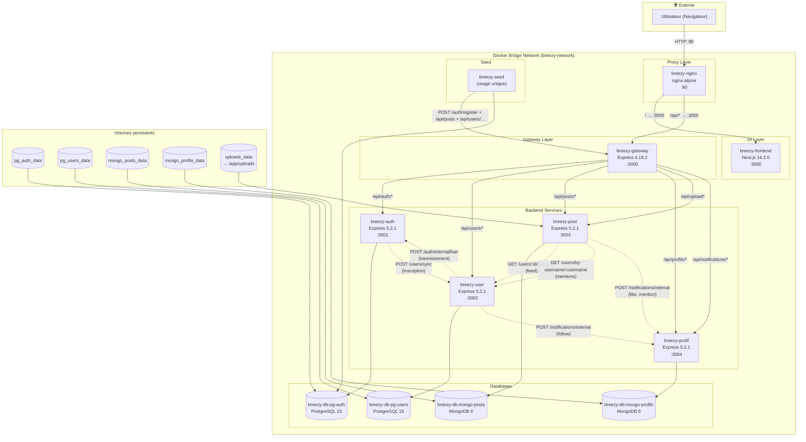

# Vue d'ensemble de l'architecture

## Conteneurs Docker

L'application Breezy est composée de **12 conteneurs Docker** interconnectés sur un réseau bridge dédié `breezy-network`.

### Services applicatifs (7)

| Conteneur | Rôle | Port exposé | Image / Build |
|---|---|---|---|
| `breezy-nginx` | Reverse proxy (Nginx) | `80:80` | `nginx:alpine` |
| `breezy-frontend` | Application Next.js | `FRONTEND_PORT` (3000) | `../breezy-frontend/Dockerfile` |
| `breezy-gateway` | API Gateway Express | `GATEWAY_PORT` (3000) | `./gateway/Dockerfile` |
| `breezy-auth` | Auth Service Express | `AUTH_PORT` (3001) | `../breezy-auth-service/Dockerfile` |
| `breezy-user` | User Service Express | `USER_PORT` (3002) | `../breezy-user-service/Dockerfile` |
| `breezy-post` | Post Service Express | `POST_PORT` (3003) | `../breezy-post-service/Dockerfile` |
| `breezy-profil` | Profil Service Express | `PROFIL_PORT` (3004) | `../breezy-profil-service/Dockerfile` |
| `breezy-seed` | Script de seeding (usage unique) | Aucun | `./seed/Dockerfile` |

### Bases de données (4)

| Conteneur | Technologie | Volume |
|---|---|---|
| `breezy-db-pg-auth` | PostgreSQL 15 Alpine | `pg_auth_data` |
| `breezy-db-pg-users` | PostgreSQL 15 Alpine | `pg_users_data` |
| `breezy-db-mongo-posts` | MongoDB 6 | `mongo_posts_data` |
| `breezy-db-mongo-profils` | MongoDB 6 | `mongo_profils_data` |

### Volumes persistants

| Volume | Montage | Service |
|---|---|---|
| `pg_auth_data` | `/var/lib/postgresql/data` | Auth DB |
| `pg_users_data` | `/var/lib/postgresql/data` | User DB |
| `mongo_posts_data` | `/data/db` | Post DB |
| `mongo_profils_data` | `/data/db` | Profil DB |
| `uploads_data` | `/app/uploads` | Post Service |

---

## Flux réseau

---

## Répartition des responsabilités

### Nginx (Proxy Layer)
- Reverse proxy exposant le port `80`
- Routage : `/api/*` vers la Gateway (`:3000`), `/*` vers le Frontend (`:3000`)
- Rate limiting : 30 req/min global, 5 req/min sur `/api/auth/`
- Taille max des requêtes : 5 Mo

### API Gateway (Express 4.19.2)
- Point d'entrée unique pour toutes les requêtes API
- Vérification des tokens JWT (Authorization Bearer)
- Injection des headers d'identité (`x-user-id`, `x-user-role`, `x-user-username`)
- Rate limiting : 500 req/15min global, 20 req/15min sur login/register
- Proxy vers les services backend

### Auth Service (Express 5.2.1 → PostgreSQL)
- Inscription et connexion des utilisateurs
- Génération et vérification des tokens JWT
- Gestion des refresh tokens (rotation, détection de vol)
- Changement de mot de passe
- Endpoint interne de bannissement
- Synchronisation des comptes vers le User Service

### User Service (Express 5.2.1 → PostgreSQL)
- CRUD des profils utilisateur (modèle `UserProfile`)
- Gestion des abonnements (follow / unfollow)
- Recherche d'utilisateurs
- Bannissement (propagation vers Auth Service)
- Service de résolution username → ID (pour les mentions @)

### Post Service (Express 5.2.1 → MongoDB)
- CRUD des posts (280 caractères max, tags, media)
- Gestion des likes (contrainte unique)
- Gestion des commentaires et réponses (1 niveau de profondeur max)
- Upload d'images (multer, 5 Mo max, format image uniquement)
- Gestion des reposts (toggle)
- Recherche par tags et contenu
- Signalement de posts
- Détection et notification des mentions @

### Profil Service (Express 5.2.1 → MongoDB)
- Gestion des profils utilisateur (display_name, bio, avatar, bannière, localisation)
- Gestion des notifications (like, follow, mention, comment, reply)
- Endpoint interne de création de notifications

---

## Flux d'appels inter-services

Tous les appels inter-services sont **non bloquants** (timeout court, échec ignoré) et protégés par le header `x-internal-secret` :

1. **Inscription** : Auth Service envoie `POST /users/sync` au User Service (création du profil)
2. **Bannissement** : User Service envoie `POST /auth/internal/ban` à Auth Service
3. **Feed** : Post Service appelle `GET /users/:id/following` sur User Service
4. **Mentions** : Post Service appelle `GET /users/by-username/:username` sur User Service
5. **Notifications like** : Post Service envoie `POST /notifications/internal` au Profil Service
6. **Notifications follow** : User Service envoie `POST /notifications/internal` au Profil Service

---

## Healthchecks

Chaque base de données dispose d'un healthcheck configuré dans docker-compose :

- **PostgreSQL** : `pg_isready -U <user> -d <db>` (interval 5s, timeout 5s, retries 10)
- **MongoDB** : `mongosh -u <user> -p <password> --authenticationDatabase admin --eval "db.adminCommand('ping')"` (interval 5s, timeout 5s, retries 10)

Les services backend attendent que leur base de données soit healthy avant de démarrer (`condition: service_healthy`).
