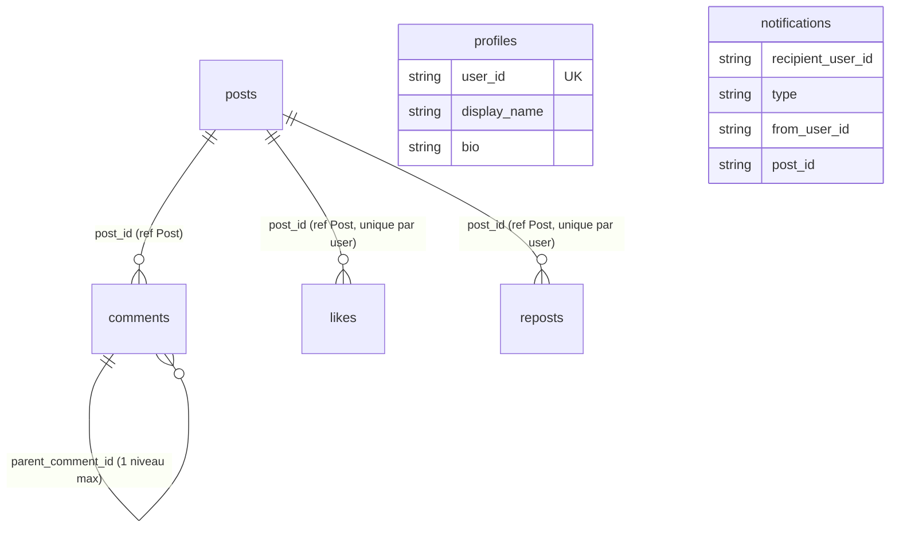

# Schéma MongoDB

Deux bases MongoDB distinctes, une par microservice documentaire. Schémas définis avec
**Mongoose 9**, index déclarés explicitement dans les modèles.

| Base | Service | Conteneur | Image |
|---|---|---|---|
| `posts_db` | post-service | `mongo-posts` (`breezy-db-mongo-posts`) | `mongo:6` |
| `profils_db` | profil-service | `mongo-profils` (`breezy-db-mongo-profils`) | `mongo:6` |

Connexion via `MONGO_URI`. Tous les timestamps sont renommés `created_at` / `updated_at`.

---

## Base `posts_db`

### Collection `posts`

```javascript
{
  _id: ObjectId,
  user_id: String,        // UUID de l'auteur (source : auth-service)
  username: String,       // dénormalisé (évite un appel inter-service à l'affichage)
  content: String,        // requis, max 280
  tags: [String],         // chaque tag max 30
  media_urls: [String],   // URLs renvoyées par /api/upload
  likes_count: Number,    // default 0, min 0
  comments_count: Number, // default 0, min 0
  reposts_count: Number,  // default 0, min 0
  is_reported: Boolean,   // default false
  created_at: Date,
  updated_at: Date
}
```

**Index** : `{user_id:1}`, `{user_id:1, created_at:-1}` (timeline), `{tags:1}` (recherche tag),
`{created_at:-1}` (feed global). Pas d'index `$text` (la recherche utilise des regex).

### Collection `comments`

```javascript
{
  _id: ObjectId,
  post_id: ObjectId,            // ref 'Post', requis
  user_id: String,             // requis
  username: String,            // dénormalisé
  content: String,             // requis, max 280
  parent_comment_id: ObjectId, // ref 'Comment', null = commentaire racine
  created_at: Date,
  updated_at: Date
}
```

**Index** : `{post_id:1, created_at:1}`, `{parent_comment_id:1}`.

**Profondeur max = 1** : une réponse a `parent_comment_id` non nul ; répondre à une réponse est
refusé (`MAX_DEPTH`). À la suppression d'un commentaire, ses réponses sont supprimées
(`deleteMany({ parent_comment_id })`).

### Collections `likes` et `reposts`

```javascript
{
  _id: ObjectId,
  post_id: ObjectId,   // ref 'Post', requis
  user_id: String,     // requis
  created_at: Date     // updatedAt: false
}
```

**Index unique `{post_id:1, user_id:1}`** pour les deux : un like / repost unique par
utilisateur et par post. Une violation (code Mongo `11000`) est traduite en `409 ALREADY_LIKED`
pour les likes.

!!! note "Cascade manuelle, incomplète"
    Supprimer un post supprime ses `likes` et `comments` (boucle dans le contrôleur), mais
    **pas ses `reposts`** → reposts orphelins possibles.

### Exemple de document `posts`

```json
{
  "_id": "665f1a2b3c4d5e6f7a8b9c0d",
  "user_id": "550e8400-e29b-41d4-a716-446655440000",
  "username": "alex_photo",
  "content": "Coucou Breezy ! @lea_voyage tu as vu ce coucher de soleil ? 🌅 #photo",
  "tags": ["photo"],
  "media_urls": ["/api/uploads/1718712345678-12345.jpg"],
  "likes_count": 4,
  "comments_count": 2,
  "reposts_count": 1,
  "is_reported": false,
  "created_at": "2026-06-20T18:30:00.000Z",
  "updated_at": "2026-06-20T18:30:00.000Z"
}
```

---

## Base `profils_db`

### Collection `profiles`

```javascript
{
  _id: ObjectId,
  user_id: String,       // UUID, unique
  display_name: String,  // max 100, default ''
  bio: String,           // max 160, default ''
  avatar_url: String,    // default ''
  banner_url: String,    // default ''
  location: String,      // max 100, default ''
  created_at: Date,
  updated_at: Date
}
```

**Index** : `{user_id:1}` unique. Créé à la demande via `findOneAndUpdate(..., { upsert:true })`.

!!! warning "Limites de longueur non garanties"
    `runValidators` n'est pas activé sur les `findOneAndUpdate` → les `maxlength` (100 pour
    `display_name`/`location`) ne sont pas appliqués en base. Seule la `bio` a un contrôle
    manuel (> 160 → `BIO_TOO_LONG`).

### Collection `notifications`

```javascript
{
  _id: ObjectId,
  recipient_user_id: String, // requis
  type: String,              // enum: like|follow|mention|comment|reply
  from_user_id: String,      // requis
  from_username: String,     // requis (dénormalisé)
  post_id: String,           // default null (String, pas ObjectId)
  is_read: Boolean,          // default false
  created_at: Date           // updatedAt: false
}
```

**Index** : `{recipient_user_id:1, is_read:1, created_at:-1}`.

| Type | Généré par | `post_id` |
|---|---|---|
| `like` | post-service | ✅ |
| `follow` | user-service | ❌ |
| `mention` | post-service | ✅ |
| `comment` | type prévu, **jamais généré** | — |
| `reply` | type prévu, **jamais généré** | — |

Auto-notification ignorée (`recipient_user_id === from_user_id` → 204). Les modérateurs/admins
ne reçoivent pas les notifications `like`/`follow` (filtrage par rôle).

### Exemple de document `notifications`

```json
{
  "_id": "665f1b9e2a4c5d6e7f8a9b0c",
  "recipient_user_id": "550e8400-e29b-41d4-a716-446655440000",
  "type": "like",
  "from_user_id": "9f8e7d6c-5b4a-3210-fedc-ba9876543210",
  "from_username": "max_tech",
  "post_id": "665f1a2b3c4d5e6f7a8b9c0d",
  "is_read": false,
  "created_at": "2026-06-20T19:05:00.000Z"
}
```

---

## Relations implicites & dénormalisation



!!! note "Aucune intégrité référentielle inter-services"
    Les `ref` Mongoose relient des collections **d'une même base**. `post_id` dans
    `notifications` (profils_db) référence un post de posts_db **uniquement au niveau
    applicatif** (type `String`). MongoDB n'impose aucune contrainte entre bases. Le `username`
    est dénormalisé dans `posts`, `comments` et `notifications` (le username n'est pas
    modifiable dans l'app, ce qui limite le risque d'incohérence).

### Compteurs avec `$inc`

Les compteurs (`likes_count`, `comments_count`, `reposts_count`) sont mis à jour par `$inc`
atomique plutôt que recalculés. Avantage : pas de `COUNT()` coûteux. Risques relevés dans le
code : compteur de like potentiellement négatif en base (seul l'affichage est borné par
`Math.max(0, ...)`), et `comments_count` qui peut diverger lors de la suppression d'un
commentaire ayant des réponses.
