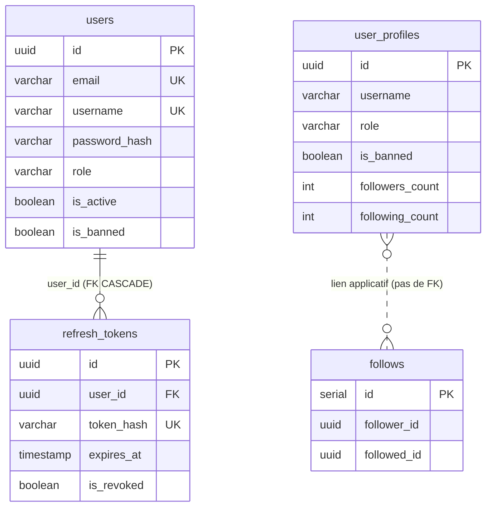
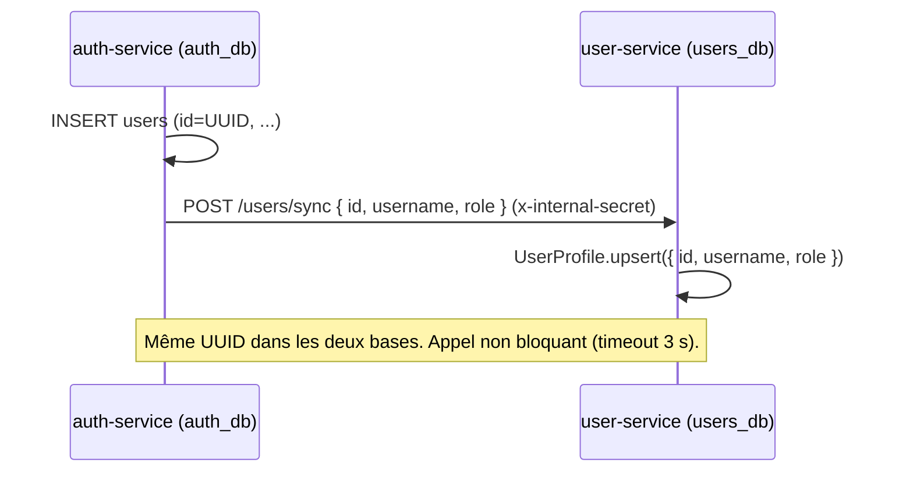

# Schéma PostgreSQL

Deux bases PostgreSQL distinctes, une par microservice relationnel.

| Base | Service | Conteneur | Image |
|---|---|---|---|
| `auth_db` | auth-service | `pg-auth` (`breezy-db-pg-auth`) | `postgres:15-alpine` |
| `users_db` | user-service | `pg-users` (`breezy-db-pg-users`) | `postgres:15-alpine` |

!!! warning "Migration automatique destructrice"
    Les deux services exécutent **`sequelize.sync({ alter: true })` au démarrage** : les tables
    sont auto-créées et auto-modifiées d'après les modèles. `alter: true` peut supprimer des
    colonnes ou modifier des types sans supervision — à proscrire en production (préférer des
    migrations explicites). Connexion via `DATABASE_URL`. Driver `pg` 8.21.0, Sequelize 6.37.8.

---

## Base `auth_db`

### Table `users`

```sql
CREATE TABLE users (
    id            UUID PRIMARY KEY DEFAULT gen_random_uuid(),
    email         VARCHAR(255) NOT NULL UNIQUE,
    username      VARCHAR(50)  NOT NULL UNIQUE,
    password_hash VARCHAR(255) NOT NULL,
    role          VARCHAR(20)  DEFAULT 'user'
                  CHECK (role IN ('user','moderator','admin')),
    is_active     BOOLEAN      DEFAULT true,
    is_banned     BOOLEAN      DEFAULT false,
    created_at    TIMESTAMP WITH TIME ZONE DEFAULT NOW(),
    updated_at    TIMESTAMP WITH TIME ZONE DEFAULT NOW()
);
```

| Contrainte | Détail |
|---|---|
| PK | `id` (UUIDV4 généré par Sequelize) |
| UNIQUE | `email`, `username` |
| CHECK | `role` ∈ {user, moderator, admin} (ENUM Sequelize) |

`password_hash` contient le hash bcrypt (jamais le mot de passe en clair).

### Table `refresh_tokens`

```sql
CREATE TABLE refresh_tokens (
    id         UUID PRIMARY KEY DEFAULT gen_random_uuid(),
    user_id    UUID NOT NULL REFERENCES users(id) ON DELETE CASCADE,
    token_hash VARCHAR(512) NOT NULL UNIQUE,
    expires_at TIMESTAMP WITH TIME ZONE NOT NULL,
    is_revoked BOOLEAN DEFAULT false,
    created_at TIMESTAMP WITH TIME ZONE DEFAULT NOW(),
    updated_at TIMESTAMP WITH TIME ZONE DEFAULT NOW()
);
```

| Contrainte | Détail |
|---|---|
| PK | `id` |
| UNIQUE | `token_hash` (SHA-256 du token brut) |
| FK | `user_id → users(id)` `ON DELETE CASCADE` (`User.hasMany`) |

Plusieurs refresh tokens par utilisateur (multi-appareils). Un token expiré/révoqué est conservé
avec ses flags.

---

## Base `users_db`

### Table `user_profiles`

```sql
CREATE TABLE user_profiles (
    id              UUID PRIMARY KEY,          -- imposé par l'auth-service (pas de DEFAULT)
    username        VARCHAR(50) NOT NULL,
    role            VARCHAR(20) DEFAULT 'user'
                    CHECK (role IN ('user','moderator','admin')),
    is_active       BOOLEAN DEFAULT true,
    is_banned       BOOLEAN DEFAULT false,
    followers_count INTEGER DEFAULT 0,
    following_count INTEGER DEFAULT 0,
    created_at      TIMESTAMP WITH TIME ZONE DEFAULT NOW(),
    updated_at      TIMESTAMP WITH TIME ZONE DEFAULT NOW()
);
```

- `id` est l'**UUID partagé** avec l'auth-service (transmis par `POST /users/sync`), sans
  génération automatique.
- **Pas de contrainte UNIQUE sur `username`** dans le modèle (la source de vérité est l'auth-service).
- `followers_count` / `following_count` mis à jour atomiquement via `increment()` / `decrement()`
  dans des transactions.

### Table `follows`

```sql
CREATE TABLE follows (
    id          SERIAL PRIMARY KEY,
    follower_id UUID NOT NULL,
    followed_id UUID NOT NULL,
    created_at  TIMESTAMP WITH TIME ZONE DEFAULT NOW(),
    UNIQUE (follower_id, followed_id)
);
```

- **Pas de colonne `updated_at`** (`updatedAt: false`).
- **Pas de FK** vers `user_profiles` : les relations sont gérées au niveau applicatif (évite les
  contraintes inter-bases). L'index unique `(follower_id, followed_id)` empêche les doublons.

!!! warning "Conséquences de l'absence de FK"
    Supprimer un profil ne nettoie pas ses `follows` → relations orphelines possibles et
    compteurs (`followers_count`/`following_count`) potentiellement incohérents, sans garde-fou
    contre les valeurs négatives en base.

---

## Diagramme ERD



!!! note "Deux bases, pas de FK inter-bases"
    `users.id` (auth_db) et `user_profiles.id` (users_db) partagent le **même UUID**, mais
    aucune contrainte ne les relie : la cohérence repose sur le flux `POST /users/sync`
    (non bloquant).

---

## Synchronisation des comptes


