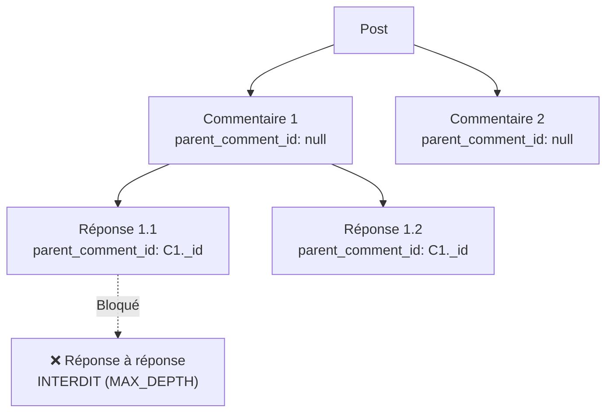
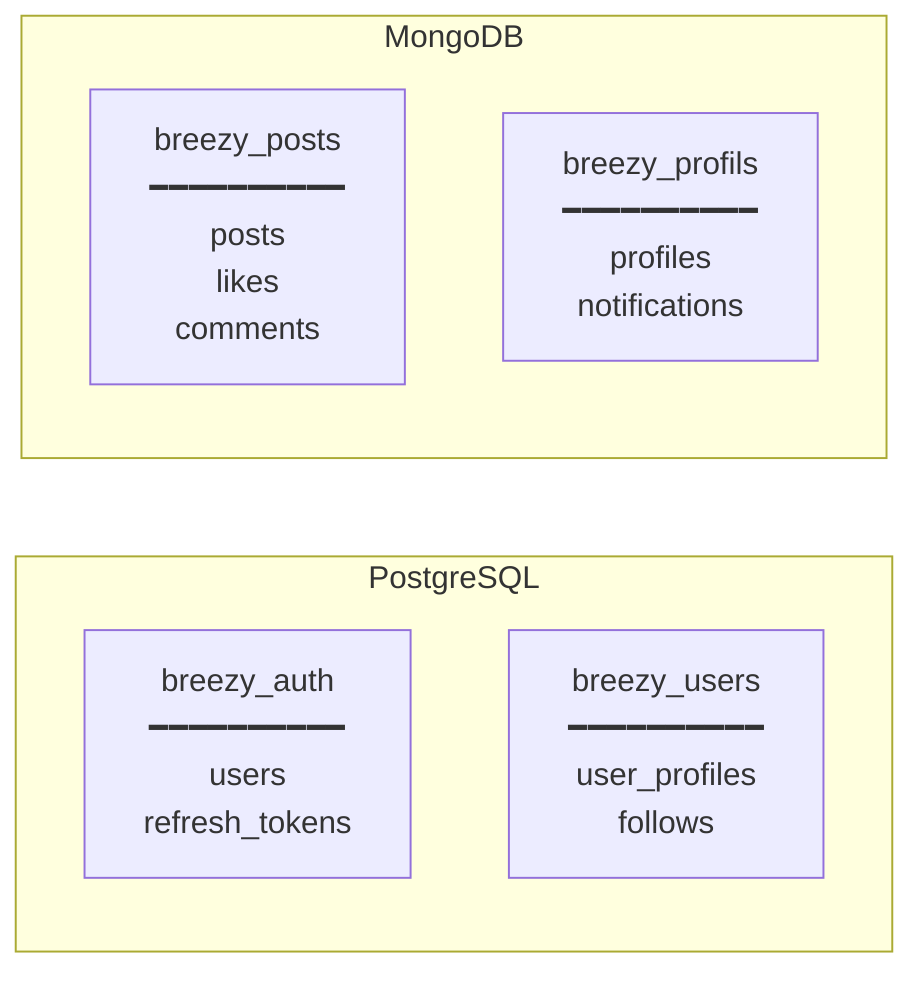

# Schémas MongoDB

Les services **post-service** et **profil-service** utilisent chacun leur propre instance MongoDB 6 via Mongoose 9.

## post-service — Base `breezy_posts`

### Collection `posts`

(`breezy-post-service/src/models/post.model.js`)

| Champ | Type | Contraintes | Description |
|-------|------|-------------|-------------|
| `_id` | `ObjectId` | PK (auto) | Identifiant MongoDB |
| `user_id` | `String` | required, indexé | UUID de l'auteur |
| `username` | `String` | required | Nom d'utilisateur de l'auteur |
| `content` | `String` | required, maxlength 280 | Contenu du post |
| `tags` | `[String]` | maxlength 30 par tag | Liste de tags |
| `media_urls` | `[String]` | — | URLs des médias attachés |
| `likes_count` | `Number` | default 0, min 0 | Compteur de likes |
| `comments_count` | `Number` | default 0, min 0 | Compteur de commentaires |
| `is_reported` | `Boolean` | default false | Post signalé |
| `created_at` | `Date` | auto (timestamps) | Date de création |
| `updated_at` | `Date` | auto (timestamps) | Date de modification |

**Index :**

```javascript
postSchema.index({ user_id: 1, created_at: -1 });  // Posts d'un utilisateur, triés par date
postSchema.index({ tags: 1 });                       // Recherche par tag
postSchema.index({ created_at: -1 });                // Tri chronologique global
```

---

### Collection `likes`

(`breezy-post-service/src/models/like.model.js`)

| Champ | Type | Contraintes | Description |
|-------|------|-------------|-------------|
| `_id` | `ObjectId` | PK (auto) | Identifiant MongoDB |
| `post_id` | `ObjectId` | required, ref 'Post' | Post liké |
| `user_id` | `String` | required | UUID de l'utilisateur |
| `created_at` | `Date` | auto (timestamps) | Date du like |

**Index :**

```javascript
likeSchema.index({ post_id: 1, user_id: 1 }, { unique: true });
// Un utilisateur ne peut liker qu'une seule fois un même post
```

!!! info "Pas de updatedAt"
    Le modèle Like a `updatedAt: false` — un like ne se modifie pas, il se crée ou se supprime.

---

### Collection `comments`

(`breezy-post-service/src/models/comment.model.js`)

| Champ | Type | Contraintes | Description |
|-------|------|-------------|-------------|
| `_id` | `ObjectId` | PK (auto) | Identifiant MongoDB |
| `post_id` | `ObjectId` | required, ref 'Post' | Post commenté |
| `user_id` | `String` | required | UUID de l'auteur |
| `username` | `String` | required | Nom d'utilisateur de l'auteur |
| `content` | `String` | required, maxlength 280 | Contenu du commentaire |
| `parent_comment_id` | `ObjectId` | default null, ref 'Comment' | Commentaire parent (null = racine) |
| `created_at` | `Date` | auto | Date de création |
| `updated_at` | `Date` | auto | Date de modification |

**Index :**

```javascript
commentSchema.index({ post_id: 1, created_at: 1 });     // Commentaires d'un post, triés par date
commentSchema.index({ parent_comment_id: 1 });            // Réponses d'un commentaire
```

**Structure des réponses :**



La profondeur est limitée à 1 niveau : un commentaire peut avoir des réponses, mais une réponse ne peut pas avoir de sous-réponses.

---

## profil-service — Base `breezy_profils`

### Collection `profiles`

(`breezy-profil-service/src/models/profile.model.js`)

| Champ | Type | Contraintes | Description |
|-------|------|-------------|-------------|
| `_id` | `ObjectId` | PK (auto) | Identifiant MongoDB |
| `user_id` | `String` | required, unique | UUID de l'utilisateur |
| `display_name` | `String` | maxlength 100, default `''` | Nom affiché |
| `bio` | `String` | maxlength 160, default `''` | Biographie |
| `avatar_url` | `String` | default `''` | URL de l'avatar |
| `banner_url` | `String` | default `''` | URL de la bannière |
| `created_at` | `Date` | auto | Date de création |
| `updated_at` | `Date` | auto | Date de modification |

**Index :**

```javascript
profileSchema.index({ user_id: 1 }, { unique: true });
```

!!! info "Upsert automatique"
    Le profil est créé automatiquement lors du premier accès via `GET /profiles/:userId` grâce à `findOneAndUpdate` avec `upsert: true`.

---

### Collection `notifications`

(`breezy-profil-service/src/models/notification.model.js`)

| Champ | Type | Contraintes | Description |
|-------|------|-------------|-------------|
| `_id` | `ObjectId` | PK (auto) | Identifiant MongoDB |
| `recipient_user_id` | `String` | required | UUID du destinataire |
| `type` | `String` | required, enum | Type de notification |
| `from_user_id` | `String` | required | UUID de l'expéditeur |
| `from_username` | `String` | required | Nom de l'expéditeur |
| `post_id` | `String` | default null | ID du post concerné |
| `is_read` | `Boolean` | default false | Notification lue |
| `created_at` | `Date` | auto | Date de création |

**Types de notification :** `like`, `follow`, `mention`, `comment`, `reply`

**Index :**

```javascript
notificationSchema.index({ recipient_user_id: 1, is_read: 1, created_at: -1 });
// Notifications d'un utilisateur, filtrées par statut lu/non lu, triées par date
```

!!! note "Pas de updatedAt"
    Le modèle Notification a `updatedAt: false` — seul `is_read` change via les endpoints de marquage.

---

## Résumé des bases de données



| Base | Moteur | Service | Collections/Tables |
|------|--------|---------|-------------------|
| `breezy_auth` | PostgreSQL 15 | auth-service | `users`, `refresh_tokens` |
| `breezy_users` | PostgreSQL 15 | user-service | `user_profiles`, `follows` |
| `breezy_posts` | MongoDB 6 | post-service | `posts`, `likes`, `comments` |
| `breezy_profils` | MongoDB 6 | profil-service | `profiles`, `notifications` |
