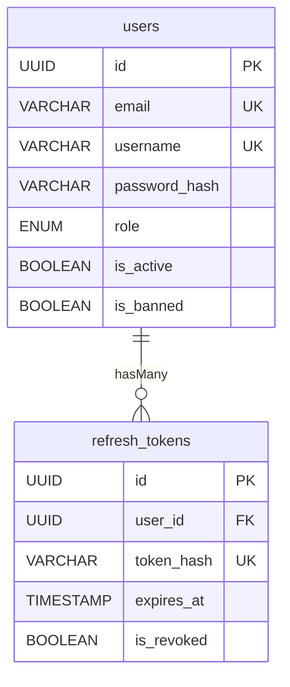
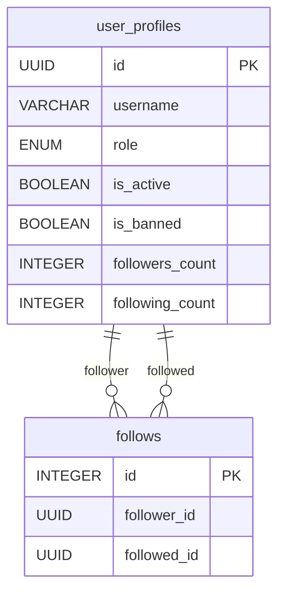
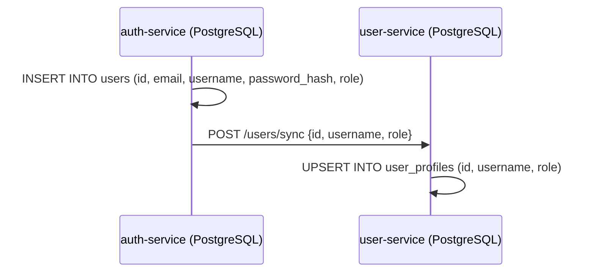

# Schémas PostgreSQL

Les services **auth-service** et **user-service** utilisent chacun leur propre instance PostgreSQL 15 via Sequelize 6 (ORM). Les tables sont synchronisées automatiquement au démarrage avec `sequelize.sync({ alter: true })`.

## auth-service — Base `breezy_auth`

### Table `users`

Représente un compte utilisateur avec ses credentials et son statut.

(`breezy-auth-service/src/models/user.model.js`)

| Colonne | Type | Contraintes | Description |
|---------|------|-------------|-------------|
| `id` | `UUID` | PK, default `UUIDV4` | Identifiant unique |
| `email` | `VARCHAR(255)` | UNIQUE, NOT NULL | Adresse email |
| `username` | `VARCHAR(50)` | UNIQUE, NOT NULL | Nom d'utilisateur |
| `password_hash` | `VARCHAR(255)` | NOT NULL | Hash bcrypt du mot de passe |
| `role` | `ENUM('user', 'moderator', 'admin')` | default `'user'` | Rôle de l'utilisateur |
| `is_active` | `BOOLEAN` | default `true` | Compte actif |
| `is_banned` | `BOOLEAN` | default `false` | Compte banni |
| `created_at` | `TIMESTAMP` | auto (Sequelize) | Date de création |
| `updated_at` | `TIMESTAMP` | auto (Sequelize) | Date de modification |

```sql
-- Représentation SQL équivalente
CREATE TABLE users (
    id          UUID PRIMARY KEY DEFAULT gen_random_uuid(),
    email       VARCHAR(255) UNIQUE NOT NULL,
    username    VARCHAR(50)  UNIQUE NOT NULL,
    password_hash VARCHAR(255) NOT NULL,
    role        VARCHAR(10)  DEFAULT 'user'
                CHECK (role IN ('user', 'moderator', 'admin')),
    is_active   BOOLEAN DEFAULT true,
    is_banned   BOOLEAN DEFAULT false,
    created_at  TIMESTAMP WITH TIME ZONE DEFAULT NOW(),
    updated_at  TIMESTAMP WITH TIME ZONE DEFAULT NOW()
);
```

### Table `refresh_tokens`

Stocke les refresh tokens sous forme de hash SHA-256 (jamais en clair). Un utilisateur peut avoir plusieurs tokens actifs (multi-appareils).

(`breezy-auth-service/src/models/refreshToken.model.js`)

| Colonne | Type | Contraintes | Description |
|---------|------|-------------|-------------|
| `id` | `UUID` | PK, default `UUIDV4` | Identifiant unique |
| `user_id` | `UUID` | NOT NULL, FK → `users.id` | Utilisateur propriétaire |
| `token_hash` | `VARCHAR(512)` | UNIQUE, NOT NULL | Hash SHA-256 du token |
| `expires_at` | `TIMESTAMP` | NOT NULL | Date d'expiration |
| `is_revoked` | `BOOLEAN` | default `false` | Token révoqué |
| `created_at` | `TIMESTAMP` | auto | Date de création |
| `updated_at` | `TIMESTAMP` | auto | Date de modification |

**Relations :**



- `User.hasMany(RefreshToken)` avec `onDelete: 'CASCADE'`
- `RefreshToken.belongsTo(User)`

---

## user-service — Base `breezy_users`

### Table `user_profiles`

Profil public d'un utilisateur, créé par synchronisation depuis l'auth-service. L'ID est identique à celui du modèle `User` dans l'auth-service.

(`breezy-user-service/src/models/userProfile.model.js`)

| Colonne | Type | Contraintes | Description |
|---------|------|-------------|-------------|
| `id` | `UUID` | PK (pas d'auto-génération) | Même UUID que dans auth-service |
| `username` | `VARCHAR(50)` | NOT NULL | Nom d'utilisateur |
| `role` | `ENUM('user', 'moderator', 'admin')` | default `'user'` | Rôle répliqué depuis auth-service |
| `is_active` | `BOOLEAN` | default `true` | Compte actif |
| `is_banned` | `BOOLEAN` | default `false` | Compte banni |
| `followers_count` | `INTEGER` | default `0` | Nombre de followers |
| `following_count` | `INTEGER` | default `0` | Nombre d'abonnements |
| `created_at` | `TIMESTAMP` | auto | Date de création |
| `updated_at` | `TIMESTAMP` | auto | Date de modification |

!!! info "ID imposé"
    Contrairement à la table `users` de l'auth-service, l'ID n'est **pas généré automatiquement**. Il est imposé par l'auth-service lors de la synchronisation (`POST /users/sync`).

### Table `follows`

Relation de suivi entre deux utilisateurs.

(`breezy-user-service/src/models/follow.model.js`)

| Colonne | Type | Contraintes | Description |
|---------|------|-------------|-------------|
| `id` | `INTEGER` | PK, auto-increment | Identifiant (Sequelize par défaut) |
| `follower_id` | `UUID` | NOT NULL | Celui qui suit |
| `followed_id` | `UUID` | NOT NULL | Celui qui est suivi |
| `created_at` | `TIMESTAMP` | auto | Date du follow |

**Index :** `UNIQUE(follower_id, followed_id)` — empêche de suivre deux fois la même personne.

**Particularité** : `updatedAt: false` — pas de colonne `updated_at` sur cette table.

**Relations :**



!!! note "Pas de foreign key Sequelize"
    Le modèle `Follow` n'a **pas** de relation Sequelize définie (`belongsTo`, `hasMany`). La cohérence est assurée au niveau applicatif dans le controller, pas par des contraintes de base de données.

---

## Synchronisation des données entre services



Les données répliquées entre les deux bases sont :

| Champ | Source (auth) | Réplique (user) |
|-------|--------------|-----------------|
| `id` | Généré (UUIDV4) | Copié tel quel |
| `username` | Défini à l'inscription | Copié |
| `role` | Défini à l'inscription | Copié |
| `is_banned` | Mis à jour via `/auth/internal/ban` | Mis à jour via `/users/:id/ban` |

!!! warning "Risque de désynchronisation"
    Les champs `is_active` et `is_banned` existent dans les deux bases mais ne sont synchronisés que pour le bannissement (et dans un seul sens à la fois). Si un admin modifie directement `is_active` dans une base, l'autre ne sera pas mise à jour.
