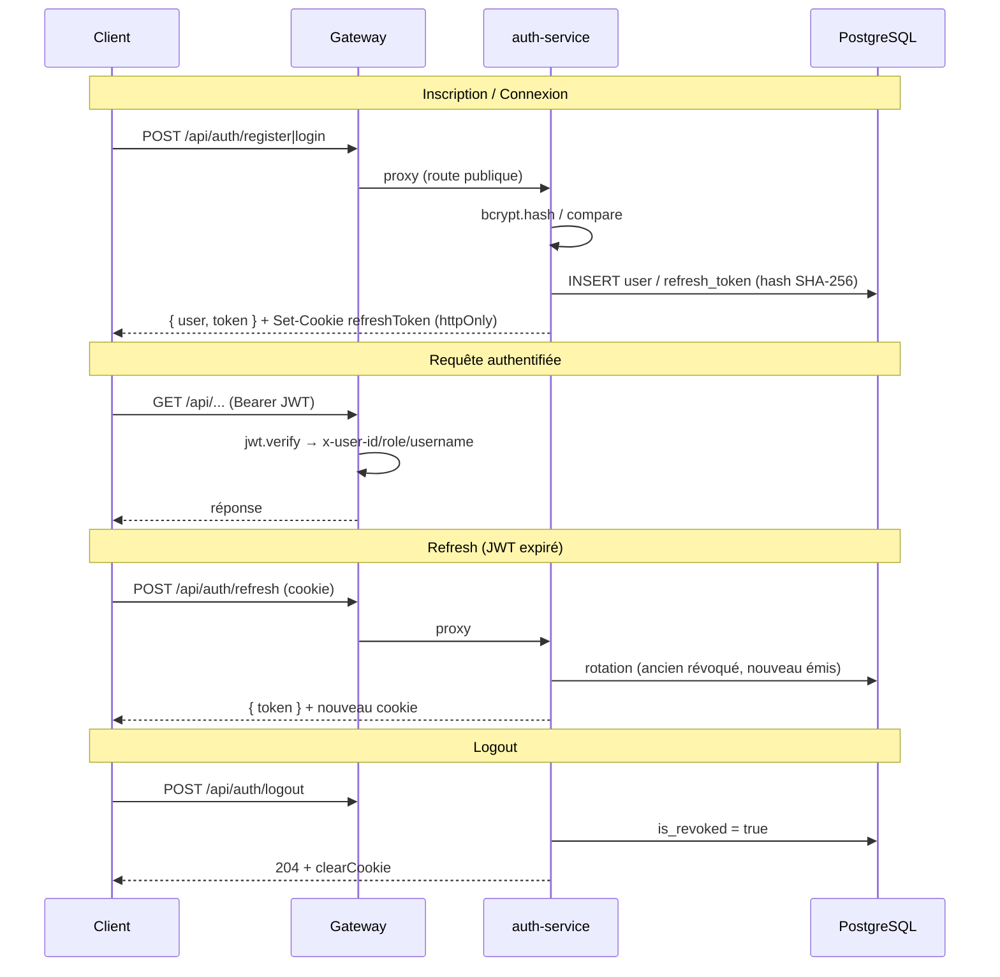
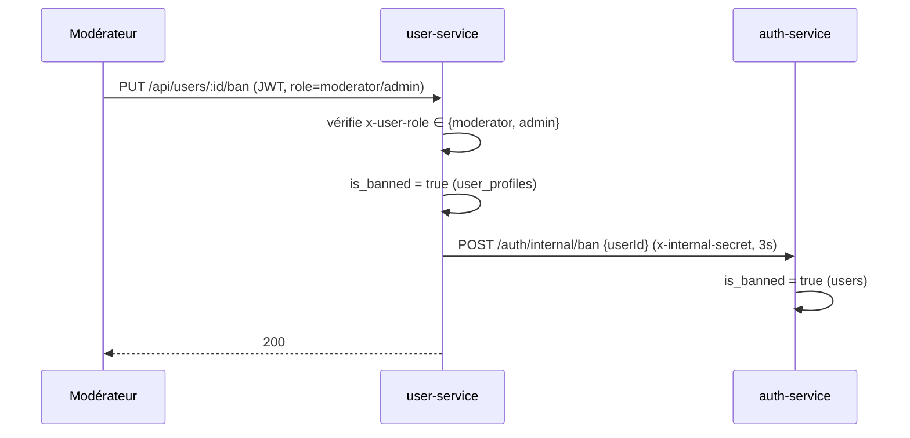

# Authentification

L'authentification repose sur un **double token** (JWT court + refresh token long) et une
**gateway centralisée** : elle seule vérifie le JWT, puis injecte l'identité dans des headers à
destination des services backend (qui ne vérifient jamais le JWT eux-mêmes).

---

## Flux complet



---

## JWT (access token)

### Payload exact

```json
{ "sub": "<uuid>", "username": "johndoe", "role": "user", "iat": 1718000000, "exp": 1718000900 }
```

| Champ | Description |
|---|---|
| `sub` | UUID de l'utilisateur |
| `username` | Nom d'utilisateur |
| `role` | `user` / `moderator` / `admin` |
| `iat` / `exp` | Émission / expiration (ajoutés par jsonwebtoken) |

!!! note "Pas d'email dans le token"
    Le payload ne contient que `sub`, `username`, `role`. La gateway les mappe respectivement
    vers `x-user-id`, `x-user-username`, `x-user-role`.

### Génération & durée

```javascript
// auth-service/src/utils/jwt.utils.js
const generateAccessToken = (user) =>
  jwt.sign({ sub: user.id, username: user.username, role: user.role },
           process.env.JWT_SECRET, { expiresIn: process.env.JWT_EXPIRES_IN || '15m' });
```

- **Algorithme** : HS256. **Durée** : `JWT_EXPIRES_IN`, défaut/docker `15m`.
- **Secret** : `JWT_SECRET` (l'auth-service fait `exit(1)` s'il est absent).

### Vérification (gateway uniquement)

```javascript
// gateway/src/utils/jwt.utils.js
const JWT_SECRET = process.env.JWT_SECRET || "defaultSecret";   // ⚠️ fallback
const verifyToken = (token) => { try { return jwt.verify(token, JWT_SECRET); } catch { return null; } };
```

!!! danger "Fallback `defaultSecret`"
    Si `JWT_SECRET` manquait côté gateway, elle accepterait des tokens signés avec
    `"defaultSecret"`. docker-compose fournit la variable, mais le fallback reste une faille
    latente.

---

## Refresh token

| Caractéristique | Valeur |
|---|---|
| Génération | `crypto.randomBytes(64).toString('hex')` (128 caractères hex, opaque) |
| Stockage | hash **SHA-256** uniquement (`token_hash`, jamais en clair) |
| Durée | `REFRESH_TOKEN_DAYS`, défaut/docker `7` jours |
| Transport | cookie `refreshToken` : `httpOnly`, `secure` si `NODE_ENV=production`, `sameSite: 'Strict'` |

### Rotation & détection de vol

À chaque `POST /auth/refresh` : l'ancien token est révoqué, un nouveau est émis. Si un token
**déjà révoqué** est présenté (signe d'un rejeu / vol), **tous** les tokens de l'utilisateur sont
révoqués :

```javascript
if (stored.is_revoked) {
  await RefreshToken.update({ is_revoked: true }, { where: { user_id: stored.user_id } });
  // L'attaquant ET l'utilisateur légitime sont déconnectés.
}
```

Le refresh échoue aussi (401 + `clearCookie`) si le token est introuvable, expiré, ou si
l'utilisateur est inactif/banni. **`change-password` révoque également tous les refresh tokens.**

---

## Hachage des mots de passe

| Élément | Valeur |
|---|---|
| Bibliothèque | `bcryptjs` |
| Rounds | `BCRYPT_ROUNDS` — **défaut code 12, docker 10, tests 4** |
| Vérification | `bcrypt.compare(password, user.password_hash)` |

Validation à l'inscription (`express-validator`) : mot de passe ≥ 8, ≥ 1 majuscule, ≥ 1 chiffre ;
username 3–50 alphanumérique + `_`.

---

## Bannissement



| Après bannissement | Comportement |
|---|---|
| Nouveau login | `403 ACCOUNT_BANNED` |
| JWT existant | reste valide jusqu'à expiration (≤ 15 min) |
| Refresh | échoue (l'utilisateur est revérifié pendant le refresh) |
| Visibilité | exclu de `/users/search`, mais **encore visible** via `/users/:id` |

La propagation auth est **non bloquante** : le ban local s'applique même si l'auth-service est
indisponible. Pas de fonction d'unban.

---

## Communication inter-services (`INTERNAL_SECRET`)

```javascript
if (req.headers['x-internal-secret'] !== process.env.INTERNAL_SECRET)
  return res.status(401).json({ error: { code: 'UNAUTHORIZED' } });
```

| Endpoint interne | Service | Appelé par |
|---|---|---|
| `POST /users/sync` | user | auth |
| `POST /auth/internal/ban` | auth | user |
| `GET /auth/internal/users/:id/role` | auth | profil |
| `POST /api/notifications/internal` | profil | post, user |

**Jamais exposé au client** : la gateway ne transmet pas `x-internal-secret` et ne le possède pas.

---

## Rate limiting

| Couche | Statut réel | Détail |
|---|---|---|
| **Gateway** (express-rate-limit) | ✅ **actif** | global 500/15min, auth 20/15min |
| **Nginx** | ❌ **non appliqué** | zones définies (30 r/m, 5 r/m) mais aucune directive `limit_req` |

!!! note "Correction par rapport à l'ancienne doc"
    L'ancienne documentation indiquait `NODE_ENV=test` désactivant le rate limiting de la
    gateway. Le `docker-compose.yml` actuel fixe **`NODE_ENV=production`** → les limiteurs de la
    gateway sont **bien actifs**. Le rate limiting Nginx, lui, n'a jamais été activé (zones
    déclarées mais inutilisées).

---

## Protection contre les attaques

| Attaque | Protection |
|---|---|
| Force brute | Rate limiting gateway (20 req/15min sur login/register) |
| Énumération de comptes | Message `INVALID_CREDENTIALS` identique que l'email existe ou non |
| Vol de JWT | Durée courte (15 min), signature HMAC |
| Vol de refresh token | Rotation + détection de rejeu → révocation de tous les tokens |
| XSS (vol de token) | Refresh token en cookie `httpOnly` |
| CSRF | Cookie `sameSite: Strict` |
| Auto-notification | Ignorée si `recipient === sender` (profil-service) |

!!! warning "Limites connues"
    Headers `x-user-*` non signés (usurpation possible si un service est compromis), JWT
    `secure` cookie uniquement en `production`, secrets en clair dans le dépôt. Voir
    [Secrets & configuration](secrets-configuration.md) et [Limites](../soutenance/limites.md).
