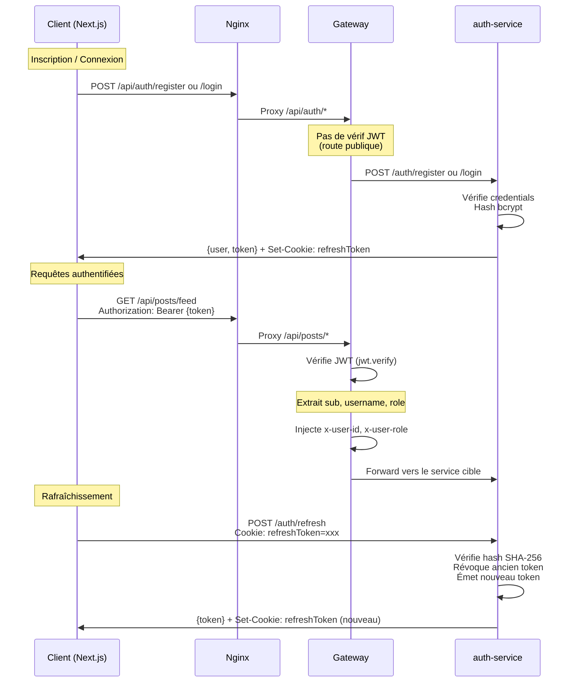
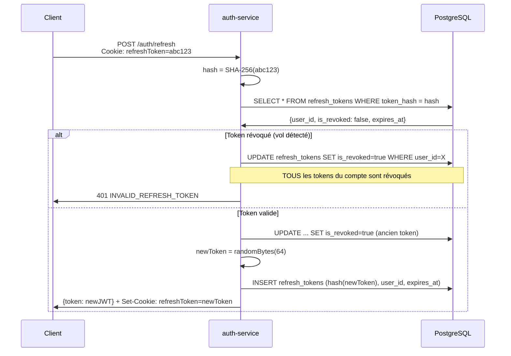

# Authentification & JWT

## Vue d'ensemble

Breezy utilise un système d'authentification basé sur **JWT (JSON Web Tokens)** avec **rotation de refresh tokens**. Le système est conçu pour être sécurisé contre les attaques courantes (vol de session, énumération de comptes, brute force).



## Access Token (JWT)

### Génération

(`breezy-auth-service/src/utils/jwt.utils.js`)

```javascript
const generateAccessToken = (user) =>
  jwt.sign(
    { sub: user.id, username: user.username, role: user.role },
    process.env.JWT_SECRET,
    { expiresIn: process.env.JWT_EXPIRES_IN || '15m' }
  );
```

### Contenu du payload

| Claim | Description | Exemple |
|-------|-------------|---------|
| `sub` | UUID de l'utilisateur | `"a1b2c3d4-..."` |
| `username` | Nom d'utilisateur | `"alice"` |
| `role` | Rôle | `"user"`, `"moderator"`, `"admin"` |
| `iat` | Date d'émission (auto) | `1719835200` |
| `exp` | Date d'expiration (auto) | `1719836100` (15 min plus tard) |

### Vérification par la Gateway

(`breezy-infra/gateway/src/middleware/auth.js`)

```javascript
function authenticate(req, res, next) {
    const authHeader = req.headers['authorization'];
    if (!authHeader) return res.status(401).json({ message: "No token provided" });

    const token = authHeader.split(' ')[1];
    const decoded = verifyToken(token);
    if (!decoded) return res.status(403).json({ message: "Invalid or expired token" });

    req.user = decoded;
    next();
}
```

La Gateway décode le JWT et injecte les headers vers les services :

```javascript
proxyReq.setHeader('x-user-id', req.user.id);    // → req.user.sub du JWT
proxyReq.setHeader('x-user-role', req.user.role);
```

!!! warning "Divergence x-user-id"
    La Gateway lit `req.user.id` mais le claim JWT est `sub`. Cela fonctionne car `jwt.verify` retourne un objet où le claim `sub` est accessible. Cependant, dans le code de la Gateway (`gateway/src/index.js` ligne 64), c'est `req.user.id` qui est utilisé — ce qui correspond à ce que `jwt.verify` retourne après décodage (le claim `sub` est mappé à `id` par convention dans certaines versions de jsonwebtoken, mais techniquement c'est `req.user.sub`).

### Stockage côté client

(`breezy-frontend/src/services/api.js`)

Le token est stocké dans **`localStorage`** sous la clé `breezy_token` :

```javascript
// Injection automatique dans chaque requête
api.interceptors.request.use((config) => {
  const token = localStorage.getItem(TOKEN_KEY)
  if (token) config.headers.Authorization = `Bearer ${token}`
  return config
})
```

Sur une réponse **401**, le token est supprimé et l'utilisateur est redirigé vers `/signin`.

---

## Refresh Token

### Fonctionnement

Le refresh token est un token **opaque** (64 bytes aléatoires en hex) stocké :

- **Côté client** : dans un cookie `httpOnly`, `secure` (en production), `sameSite: Strict`
- **Côté serveur** : hashé en **SHA-256** dans la table `refresh_tokens`

```javascript
// Génération
const generateRefreshToken = () => crypto.randomBytes(64).toString('hex');

// Hashage avant stockage
const hashToken = (token) => crypto.createHash('sha256').update(token).digest('hex');
```

### Options du cookie

(`breezy-auth-service/src/controllers/auth.controller.js` lignes 11-16)

```javascript
const cookieOptions = {
  httpOnly: true,                                    // Inaccessible depuis JavaScript
  secure: process.env.NODE_ENV === 'production',     // HTTPS uniquement en prod
  sameSite: 'Strict',                                // Protection CSRF
  maxAge: REFRESH_TTL_MS,                            // 7 jours par défaut
};
```

### Rotation des tokens

Chaque appel à `POST /auth/refresh` :

1. Vérifie que le token présenté existe et n'est pas révoqué
2. **Révoque** l'ancien token (`is_revoked = true`)
3. Génère un **nouveau** refresh token
4. Stocke le nouveau hash en base
5. Envoie le nouveau token dans un cookie



### Détection de vol de session

(`auth.controller.js` lignes 133-137)

Si un refresh token **déjà révoqué** est présenté, cela signifie potentiellement qu'un attaquant a intercepté un token et l'a déjà utilisé. Dans ce cas, **tous les refresh tokens du compte** sont révoqués immédiatement :

```javascript
if (stored.is_revoked) {
    await RefreshToken.update(
        { is_revoked: true },
        { where: { user_id: stored.user_id } }
    );
    return res.status(401).json({ error: { code: 'INVALID_REFRESH_TOKEN' } });
}
```

---

## Hachage des mots de passe

### bcrypt

(`breezy-auth-service/src/controllers/auth.controller.js`)

- **Algorithme** : bcryptjs
- **Rounds** : 12 par défaut (configurable via `BCRYPT_ROUNDS`)
- **Hachage** : `bcrypt.hash(password, BCRYPT_ROUNDS)`
- **Vérification** : `bcrypt.compare(password, user.password_hash)`

### Protection contre l'énumération

Le login retourne le **même message d'erreur** pour un email inexistant et un mauvais mot de passe :

```javascript
const user = await User.findOne({ where: { email } });
const passwordMatches = user ? await bcrypt.compare(password, user.password_hash) : false;
if (!user || !passwordMatches) {
    return res.status(401).json({ error: { code: 'INVALID_CREDENTIALS' } });
}
```

---

## Rate Limiting

### Niveau Nginx

(`breezy-infra/nginx/nginx.conf`)

| Zone | Limite | Portée |
|------|--------|--------|
| `global` | 30 req/min | Toutes les routes |
| `auth` | 5 req/min | Routes d'authentification |

### Niveau Gateway

(`breezy-infra/gateway/src/index.js`)

| Limiteur | Fenêtre | Max | Routes |
|----------|---------|-----|--------|
| `globalLimiter` | 15 min | 100 req | Toutes |
| `authLimiter` | 15 min | 10 req | `/api/auth/*` |

!!! info "Double rate limiting"
    Le rate limiting est appliqué à **deux niveaux** : Nginx et Gateway. C'est un choix de sécurité en profondeur — même si Nginx est contourné, la Gateway limite aussi les requêtes.

---

## Validation des entrées

### Côté backend (express-validator)

(`breezy-auth-service/src/routes/auth.routes.js`)

| Champ | Règles |
|-------|--------|
| `username` | 3-50 caractères, uniquement `[a-zA-Z0-9_]` |
| `email` | Format email valide, normalisé |
| `password` | Min 8 caractères, au moins 1 majuscule, au moins 1 chiffre |

### Côté frontend

(`breezy-frontend/src/utils/validators.js`)

| Champ | Règles |
|-------|--------|
| `email` | Regex basique |
| `password` | Min 6 caractères |
| `username` | Min 2 caractères |

!!! warning "Divergence de validation"
    Le frontend est **moins strict** que le backend. Un mot de passe de 6 caractères sans majuscule passera la validation client mais sera rejeté par le serveur (qui exige 8 caractères + 1 majuscule + 1 chiffre).

---

## Résumé des mécanismes de sécurité

| Mécanisme | Implémenté | Détail |
|-----------|:----------:|--------|
| Hachage bcrypt | ✅ | 12 rounds par défaut |
| JWT signé (HS256) | ✅ | Clé secrète partagée via `JWT_SECRET` |
| Refresh token en cookie httpOnly | ✅ | Inaccessible depuis JavaScript |
| Refresh token hashé en base (SHA-256) | ✅ | Jamais stocké en clair |
| Rotation de refresh token | ✅ | Ancien révoqué à chaque refresh |
| Détection de vol de session | ✅ | Révocation totale si token réutilisé |
| Rate limiting (Nginx + Gateway) | ✅ | Double couche |
| Protection CSRF (sameSite: Strict) | ✅ | Cookie non envoyé en cross-origin |
| Protection contre l'énumération | ✅ | Message d'erreur identique |
| Validation des entrées (backend) | ✅ | express-validator |
| HTTPS (cookie secure) | ⚠️ | Uniquement en `NODE_ENV=production` |
| Confirmation email | ❌ | Non implémenté |
| 2FA / MFA | ❌ | Non implémenté |
| Changement de mot de passe | ❌ | Route déclarée côté frontend mais absente du backend |
| Réinitialisation de mot de passe | ❌ | Le bouton "Oublié ?" affiche un message mais n'envoie rien |
