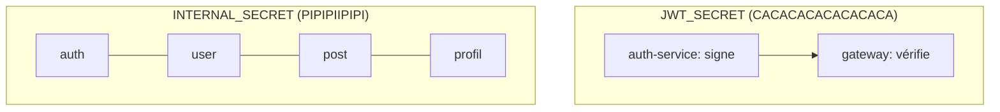

# Secrets & configuration

!!! danger "Page transversale — constats de sécurité réels"
    Cette page recense les secrets et points de configuration sensibles **observés dans le code
    et les fichiers `.env` du dépôt**. Elle est destinée à la soutenance et à la remédiation,
    pas à exposer davantage les valeurs. Les secrets ci-dessous sont des valeurs de
    développement (placeholders), mais ils sont **réellement commités** dans les dépôts.

---

## Secrets présents dans les dépôts

| Secret | Où | Constat |
|---|---|---|
| `JWT_SECRET` | `.env` infra, `.env.example` auth | `CACACACACACACACA` (placeholder), commité |
| `INTERNAL_SECRET` | `.env` des services + infra | `PIPIPIIPIPI`, commité en clair dans les `.env` |
| `OPENROUTER_API_KEY` | `.env` post-service | **clé OpenRouter réelle** (`sk-or-v1-...`) commitée — vide dans `.env.example` |
| Mots de passe BDD | `.env` infra | `auth-password`, `user-password`, `breezy-mongo-2024` |

!!! warning "Clé API réelle exposée"
    Contrairement aux autres secrets (placeholders), la clé `OPENROUTER_API_KEY` du post-service
    est une **vraie clé** utilisable. Elle devrait être révoquée et sortie du versionnement
    (rotation + `.gitignore` + secret manager).

---

## Configurations à risque

| Élément | Constat | Localisation |
|---|---|---|
| `JWT_SECRET \|\| "defaultSecret"` | Fallback dangereux : tokens acceptés si la var manque | `gateway/src/utils/jwt.utils.js` |
| `sequelize.sync({ alter: true })` | Migration auto au démarrage, potentiellement destructrice | `auth/user config/database.js` |
| `NODE_ENV=production` + bind-mounts | Config hybride dev/prod (code monté en volume) | `docker-compose.yml` |
| Rate limiting Nginx non appliqué | Zones définies mais aucune `limit_req` | `nginx/nginx.conf` |
| Cookie `secure` conditionnel | `secure` seulement si `NODE_ENV=production` ; Nginx en HTTP | `auth.controller.js`, `nginx.conf` |
| Headers `x-user-*` non signés | Usurpation possible si un service est joignable directement | tous les services |
| `runValidators` absent (Mongoose) | `maxlength` non garantis sur les profils | `profil-service` |

---

## Cohérence des secrets entre services

- `JWT_SECRET` doit être **identique** entre l'auth-service (qui signe) et la gateway (qui
  vérifie). La gateway ne signe jamais.
- `INTERNAL_SECRET` doit être **identique** dans les 4 microservices. La gateway ne le possède
  pas (elle ne fait pas d'appel interne).

---

## Recommandations de remédiation

1. **Révoquer** la clé OpenRouter exposée et la régénérer.
2. **Sortir les `.env` du versionnement** (`.gitignore`) ; ne committer que les `.env.example`
   sans valeurs réelles.
3. **Supprimer le fallback** `"defaultSecret"` (échouer si `JWT_SECRET` manque, comme le fait
   déjà l'auth-service).
4. **Remplacer** `sync({ alter: true })` par des migrations Sequelize explicites en production.
5. **Signer** les communications inter-services (JWT interne HMAC) plutôt que des headers en clair.
6. **Activer HTTPS** (TLS) pour que `secure`/`sameSite` aient un effet réel.
7. **Activer** le rate limiting Nginx (`limit_req`) ou le retirer pour éviter une fausse
   impression de protection.

!!! info "Pour la soutenance"
    Ces constats sont des **points de vigilance assumés** d'un projet pédagogique, pas des
    erreurs cachées. Les exposer clairement (et savoir comment les corriger) est valorisé.
