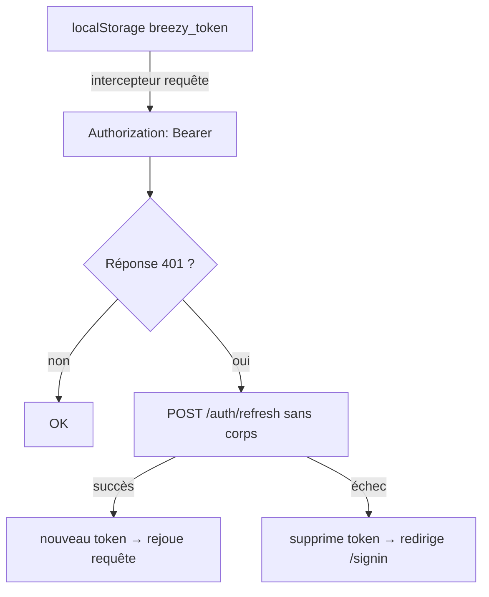

# Frontend

Application **Next.js 14 (App Router)**, mobile-first, qui consomme l'API Breezy via la
gateway. Pas de Redux/Zustand/React Query : un seul contexte React (`AuthContext`) et des hooks
custom.

- **Dépôt** : `breezy-frontend` (nom interne `breezy-nextjs`)
- **Port** : `3000`
- **Rendu** : App Router avec Route Groups `(app)` (protégé) / `(auth)` (public)

---

## Stack & dépendances

| Lib | Version | Rôle |
|---|---|---|
| next | `14.2.0` | Framework App Router |
| react / react-dom | `^18.2.0` | UI |
| axios | `^1.6.0` | Client HTTP |
| lucide-react | `^1.21.0` | Icônes |
| clsx | `^2.1.0` | Composition de classes CSS |
| tailwindcss | `^3.4.1` | Styles (devDependency) |

!!! note "README partiellement obsolète"
    Le README mentionne `date-fns`, **absent des dépendances** : le formatage des dates est fait
    maison dans `src/utils/formatDate.js`. Le README donne aussi un exemple d'`NEXT_PUBLIC_API_URL`
    (`http://localhost:4000/api`) non aligné avec `.env.local` (`/api`).

---

## Architecture des dossiers

```
src/
├── app/
│   ├── layout.js            # RootLayout : <html lang=fr>, Inter, <AuthProvider>
│   ├── page.js              # Landing "/" → redirige vers /home si token
│   ├── (app)/               # Groupe PROTÉGÉ (garde d'auth dans (app)/layout.js)
│   │   ├── home, compose, reply, search, notifications,
│   │   ├── messages, messages/[convId],
│   │   ├── profile, profile/[userId], profile/edit, settings
│   ├── (auth)/              # Groupe PUBLIC : connect, signin, register
│   └── legal/               # terms, privacy, cookies, accessibility, ads
├── components/  (ui, layout, feed, comment, profile, notifications, messages, search)
├── context/     AuthContext.js
├── hooks/        useAuth, usePosts, useComments, useFollow, useLike, useMentions
├── services/     api.js + authService, postService, commentService,
│                 userService, notificationService, messageService
├── mocks/        *.mock.js + data.js + utils.js
└── utils/        formatDate.js, validators.js, toast.js
```

Alias `@/*` → `./src/*` (`jsconfig.json`).

---

## Pages

| Route | Fichier | Rôle |
|---|---|---|
| `/` | `app/page.js` | Landing → `/home` si token, sinon logo + CTA + liens légaux |
| `/connect` | `(auth)/connect` | Landing alternatif (cible de redirection si non authentifié) |
| `/signin` | `(auth)/signin` | Connexion. Gère 429, `ACCOUNT_BANNED`, identifiants incorrects |
| `/register` | `(auth)/register` | Inscription (validation locale `validateRegisterForm`) |
| `/home` | `(app)/home` | Feed (`usePosts`) + `PostForm` desktop. Détection `@breezy_ai` (re-fetch +5 s) |
| `/compose` | `(app)/compose` | Composer un post (mobile plein écran), upload, compteur, @mentions |
| `/reply` | `(app)/reply` | Répondre à un post (`?postId=`) |
| `/search` | `(app)/search` | Recherche posts + comptes (debounce 400 ms, `Promise.allSettled`) |
| `/notifications` | `(app)/notifications` | Onglets Toutes / Mentions, marque tout lu au montage |
| `/messages` | `(app)/messages` | **Placeholder** « messagerie à venir » |
| `/messages/[convId]` | `(app)/messages/[convId]` | Redirige vers `/messages` (non implémenté) |
| `/profile` | `(app)/profile` | Profil de l'utilisateur connecté (onglets Posts/Replies/Media/Likes) |
| `/profile/[userId]` | `(app)/profile/[userId]` | Profil d'un autre (redirige vers `/profile` si soi-même) |
| `/profile/edit` | `(app)/profile/edit` | Édition (username → nouveau JWT, bio, localisation, avatar/bannière base64) |
| `/settings` | `(app)/settings` | Changement de mot de passe + section admin (création de compte) + déconnexion |
| `/legal/*` | `app/legal/*` | Pages statiques placeholder (terms, privacy, cookies, accessibility, ads) |

---

## Composants principaux

| Composant | Rôle |
|---|---|
| `AppShell` | Layout global : sidebar desktop + colonne centrale (max 600 px) + bottom nav mobile |
| `TopBar` / `BottomNav` / `DesktopSidebar` | Navigation (badges `unreadCount` / `unreadMsgCount`) |
| `RightSidebar` | Colonne droite — **non montée** (commentée dans `AppShell`) |
| `PostCard` | Affiche un post : mentions cliquables, édition inline, image, actions, commentaires |
| `PostList` | Liste paginée (« Voir plus »), états loading/erreur/vide |
| `PostForm` / `ComposeFab` | Création de post (desktop) / bouton flottant mobile |
| `PostActions` | Commenter, repost (`toggleRepost`), like (`useLike`), menu Modifier/Supprimer |
| `CommentThread` | Bottom-sheet commentaires/réponses (`useComments`) |
| `ProfileHeader` / `FollowersModal` | En-tête profil (`useFollow`) / modal abonnés-abonnements |
| `NotificationItem` | Item de notification (like/follow/mention) |
| `NotificationList` | **Non monté** (la page utilise `NotificationItem` directement) |
| `SearchBar` | Recherche + recherches récentes en `localStorage` (max 5) |
| `ConversationList`, `MessageThread`, `MessageInput` | Messagerie — **non connectés** (placeholder) |
| `Avatar`, `Button`, `Input`, `Spinner` | Primitives UI (`Button` : 7 variants + état `loading`) |

**Hooks** : `usePosts` (feed + pagination + event `postCreated`), `useComments`, `useFollow` /
`useLike` (mises à jour optimistes avec rollback), `useMentions` (autocomplétion @, debounce
250 ms via `GET /users/search`).

---

## Configuration API

`src/services/api.js` — instance Axios unique :

- **Base URL** : `process.env.NEXT_PUBLIC_API_URL || '/api'` (défaut `/api`).
- **Timeout** : 10 000 ms.
- **Rewrite Next** (`next.config.js`) : si `NEXT_PUBLIC_API_URL` commence par `http`, proxifie
  `/api/:path*` → `${apiUrl}/:path*`. Sinon (`/api`), requêtes relatives au même host.
- **Mode mock** : chaque service choisit `mock.*` ou `real.*` selon `isMockEnabled()` (vrai si
  `window` défini **et** `NEXT_PUBLIC_USE_MOCKS === 'true'`). Désactivé par défaut.

---

## Gestion du JWT



- **Stockage** : `localStorage`, clé `NEXT_PUBLIC_TOKEN_KEY || 'breezy_token'`. Lecture
  synchrone à l'init pour éviter le flash de déconnexion.
- **Envoi** : intercepteur de requête → `Authorization: Bearer <token>`.
- **Refresh automatique** : intercepteur de réponse sur `401`. File d'attente (`failedQueue`)
  pour éviter les refresh concurrents : pendant un refresh en cours, les autres requêtes
  attendent puis sont rejouées. `POST /auth/refresh` est appelé **sans corps** → repose sur le
  cookie HttpOnly de refresh géré côté backend.

!!! warning "Le refresh token n'est jamais manipulé côté front"
    Le front ne stocke qu'un **access token** (`localStorage`). Le refresh token reste dans un
    cookie HttpOnly géré par l'auth-service.

!!! warning "Protection des routes 100 % côté client"
    `(app)/layout.js` redirige vers `/connect` si aucun token. Un cookie `breezy_auth=1`
    (non-HttpOnly) est posé « pour un middleware serveur », mais **aucun `middleware.js`
    n'existe** dans le projet → ce cookie n'est exploité nulle part.

---

## Gestion des erreurs API côté UI

1. **Toasts** (`src/utils/toast.js`) : `<div>` injecté dans `document.body` (pas de lib), vert
   (succès) / rouge (erreur), disparaît après 3,5 s. Utilisé pour les échecs de publication,
   d'édition, de suppression.
2. **Messages inline** : `<p>` rouge sur `bg-red-50` (signin, register, compose, reply,
   settings, profile/edit…).

Convention d'extraction omniprésente : `err?.response?.data?.error?.message` (+ `.code` /
`.details`). Codes gérés explicitement : `429` (rate limit), `409` (conflit), `400` +
`details[]` (validation), `413` (image trop lourde), `ACCOUNT_BANNED`, `USERNAME_TAKEN`.

---

## Contexte / state management

`AuthContext` (monté dans `app/layout.js`) expose : `user`, `token`, `saveToken`, `logout`,
`loading`, `unreadCount`, `unreadMsgCount`, `refreshUnreadCount`. Au montage, si un token
existe, `getMe()` hydrate `user` (n'efface pas le token en cas d'erreur).

Communication inter-composants : `CustomEvent('postCreated')` sur `window` (émis par compose,
écouté par `usePosts`) et re-fetch sur l'événement `focus` (pages profil).

!!! note "Messagerie & compteur de messages factices"
    `messageService.getUnreadMessagesCount()` renvoie **toujours `0`** (pas d'appel API). Donc
    `unreadMsgCount` est toujours nul, et toute la messagerie (`messages/*`) est du code mort.

---

## Variables d'environnement (`NEXT_PUBLIC_*`)

| Variable | Valeur projet | Rôle |
|---|---|---|
| `NEXT_PUBLIC_API_URL` | `/api` | Base URL Axios + cible du rewrite Next |
| `NEXT_PUBLIC_TOKEN_KEY` | `breezy_token` | Clé `localStorage` du JWT |
| `NEXT_PUBLIC_USE_MOCKS` | `false` | Active les mocks `src/mocks/` |

---

## Dockerfile

`node:20-alpine`, `npm install`, `npm run build`, `ENV HOSTNAME=0.0.0.0 PORT=3000`, `EXPOSE 3000`,
`CMD ["npm","start"]`. Build Next standard (pas de mode `standalone`, pas de multi-stage).
