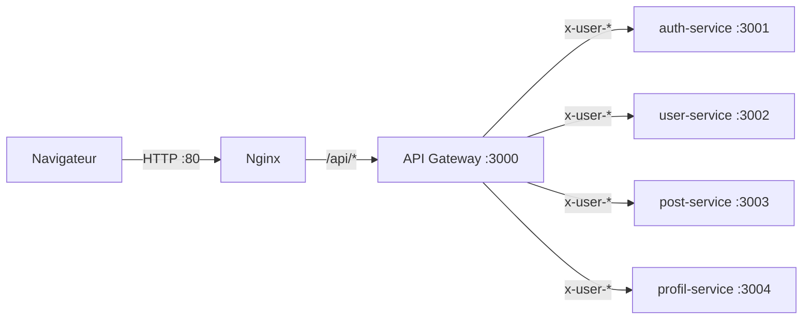
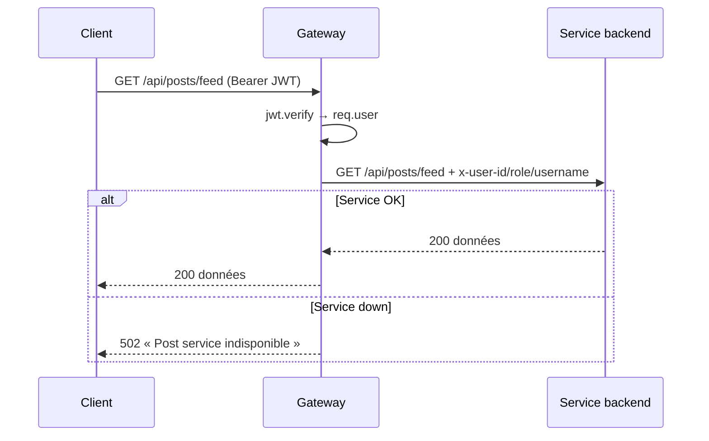

# API Gateway

Point d'entrée unique de toute l'API Breezy. La gateway est un **reverse proxy applicatif**
Express : elle vérifie le JWT une seule fois, injecte l'identité de l'utilisateur dans des
headers, applique le rate limiting, puis transmet la requête au microservice cible.

- **Dépôt / dossier** : `breezy-infra/gateway/`
- **Port interne** : `3000` (jamais publié — accessible via Nginx uniquement)
- **Stack** : Express `4.19`, `http-proxy-middleware` v3, `jsonwebtoken` v9, `express-rate-limit` v7.2

!!! info "La gateway ne signe aucun token"
    Elle ne fait que **vérifier** les JWT émis par l'auth-service. Elle ne possède pas de base
    de données et n'appelle pas les services en interne — elle se contente de proxifier.

---

## Rôle dans l'architecture



1. Reçoit toutes les requêtes `/api/*` depuis Nginx.
2. Pour les routes protégées : vérifie le header `Authorization: Bearer <JWT>`.
3. Décode le payload `{ sub, username, role }` et l'injecte dans des headers `x-user-*`.
4. Proxifie vers le service cible (résolu via les variables `*_SERVICE_URL`).
5. Renvoie un **502** si le service backend est injoignable.

---

## Table de routage

Ordre = ordre réel d'enregistrement dans `gateway/src/index.js` (premier match gagnant).

| # | Path entrant | Service cible | Réécriture `^/` → | Auth | Headers injectés |
|---|---|---|---|---|---|
| 1 | `/api/auth/me` | AUTH | `/auth/me` | **JWT** | `x-user-id`, `x-user-role`, `x-user-username` |
| 2 | `/api/auth/change-password` | AUTH | `/auth/change-password` | **JWT** | id, role, username |
| 3 | `/api/auth/username` | AUTH | `/auth/username` | **JWT** | id, role, username |
| 4 | `/api/auth/admin` | AUTH | `/auth/admin/` | **JWT** | id, role, username |
| 5 | `/api/auth` (catch-all) | AUTH | `/auth/` | **Public** | aucun |
| 6 | `/api/users` | USER | `/users/` | **JWT** | `x-user-id`, `x-user-role` **(pas username)** |
| 7 | `/api/upload` | POST | `/api/upload` | **JWT** | id, role, username |
| 8 | `/api/uploads` | POST | `/api/uploads/` | **Public** | aucun (fichiers statiques) |
| 9 | `/api/posts` | POST | `/api/posts/` | **JWT** | id, role, username |
| 10 | `/api/profils` | PROFIL | `/api/profils/` | **JWT** | id, role, username |
| 11 | `/api/notifications` | PROFIL | `/api/notifications/` | **JWT** | id, role, username |
| 12 | `GET /api/health` | gateway | — | **Public** | renvoie `{ status: 'UP', service: 'api-gateway' }` |

!!! warning "L'ordre des routes `/api/auth` est critique"
    Les sous-routes protégées (`/me`, `/change-password`, `/username`, `/admin`) sont déclarées
    **avant** le catch-all public `/api/auth`. Si on inversait l'ordre, le catch-all
    intercepterait ces routes sensibles **sans authentification**. Le code contient des
    commentaires explicites à ce sujet.

!!! warning "Le user-service ne reçoit pas `x-user-username`"
    Les routes `/api/users/*` n'injectent **que** `x-user-id` et `x-user-role`. Conséquence : le
    contrôleur `follow` du user-service lit `req.username` (issu de `x-user-username`) qui vaut
    `undefined`, donc la notification de follow part avec `from_username: undefined`.

---

## Routes publiques vs protégées

| Public (sans JWT) | Protégé (JWT requis) |
|---|---|
| `/api/auth/*` hors me/change-password/username/admin (login, register, refresh, logout) | `/api/auth/me`, `/api/auth/change-password`, `/api/auth/username`, `/api/auth/admin/*` |
| `/api/uploads/*` (fichiers statiques) | `/api/users/*`, `/api/posts/*`, `/api/upload`, `/api/profils/*`, `/api/notifications/*` |
| `GET /api/health` | — |

---

## Middlewares (ordre exact d'application)

1. `express.json({ limit: '5mb' })` — parsing du body, limite 5 Mo.
2. `globalLimiter` — **500 requêtes / 15 min / IP** (sauf `NODE_ENV=test`).
3. `authLimiter` — **20 requêtes / 15 min / IP** sur `/api/auth/login` et `/api/auth/register`.
4. Par route protégée : `authMiddleware` **puis** `createProxyMiddleware`.
5. `errorHandler` — handler d'erreurs Express enregistré en dernier.

```javascript
// gateway/src/middleware/auth.js
function authenticate(req, res, next) {
    const authHeader = req.headers['authorization'];
    if (!authHeader) return res.status(401).json({ message: "No token provided" });
    const token = authHeader.split(' ')[1];
    const decoded = verifyToken(token);            // jwt.verify(token, JWT_SECRET)
    if (!decoded) return res.status(401).json({ message: "Invalid or expired token" });
    req.user = decoded;                            // { sub, username, role, iat, exp }
    next();
}
```

!!! danger "Fallback de secret dangereux"
    `gateway/src/utils/jwt.utils.js` définit `JWT_SECRET = process.env.JWT_SECRET || "defaultSecret"`.
    Si la variable d'environnement manquait, la gateway accepterait des tokens signés avec
    `"defaultSecret"`. En l'état, docker-compose fournit bien `JWT_SECRET`, mais le fallback
    reste une faille latente.

---

## Rate limiting

| Limiteur | Fenêtre | Limite | Champ d'application |
|---|---|---|---|
| Global | 15 min | 500 req / IP | Toutes les routes API |
| Auth | 15 min | 20 req / IP | `/api/auth/login`, `/api/auth/register` |

!!! note "Le rate limiting est ACTIF dans Docker"
    Le rate limiting est désactivé uniquement si `NODE_ENV === 'test'`. Or **docker-compose
    fixe `NODE_ENV=production`** pour la gateway → les deux limiteurs sont **bien actifs**.
    (Ce point était documenté à tort comme « désactivé » dans l'ancienne doc.)

---

## Gestion des erreurs

- **Backend injoignable** : chaque proxy possède un handler `error` qui renvoie un **502** avec
  un message français spécifique (« Auth/User/Post/Profil/Notification service indisponible »).
- **Erreur générique** : `errorHandler.js` log `[Gateway Error]` et renvoie `err.status || 500`
  avec `{ error: err.message || 'Erreur interne du serveur' }`.



---

## Détails d'implémentation notables

- `app.set('trust proxy', 1)` : la gateway est derrière Nginx, l'IP réelle est lue dans
  `X-Forwarded-For`.
- `fixRequestBody` est rappelé dans chaque `proxyReq` pour ré-émettre le body JSON déjà parsé
  par `express.json` (nécessaire avec `http-proxy-middleware` v3).
- La gateway **ne reçoit pas `INTERNAL_SECRET`** (ni dans docker-compose, ni dans son code) :
  le secret inter-services ne concerne que les 4 microservices.
- `cors` est listé en dépendance mais **jamais importé** : le CORS est géré par chaque
  microservice via `CORS_ORIGIN`.

---

## Variables d'environnement

| Variable | Valeur (docker-compose) | Usage |
|---|---|---|
| `NODE_ENV` | `production` | Active le rate limiting |
| `PORT` | `3000` | Port d'écoute |
| `JWT_SECRET` | `CACACACACACACACA` | Vérification de la signature JWT |
| `AUTH_SERVICE_URL` | `http://auth-service:3001` | Cible proxy auth |
| `USER_SERVICE_URL` | `http://user-service:3002` | Cible proxy user |
| `POST_SERVICE_URL` | `http://post-service:3003` | Cible proxy post |
| `PROFIL_SERVICE_URL` | `http://profil-service:3004` | Cible proxy profil |
