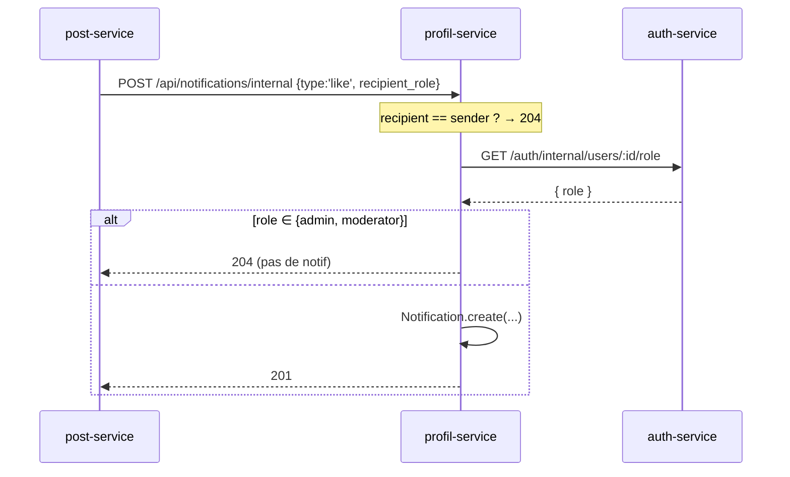

# Profil Service

Gère les **profils détaillés** (bio, avatar, bannière, localisation) et le **système de
notifications**. Stocke ses données dans MongoDB.

- **Dépôt** : `breezy-profil-service`
- **Port** : `3004`
- **Base de données** : MongoDB `profils_db` (conteneur `mongo-profils`)
- **ODM** : Mongoose 9

!!! info "Profil ≠ User"
    Le `display_name`, la `bio`, l'`avatar_url` et la `banner_url` vivent ici. Le `username` et
    les compteurs de follow vivent dans le **user-service**. Le frontend fusionne les deux via
    `getFullProfile` (`/users/:id` + `/profils/:id`).

---

## Stack & dépendances

| Paquet | Version |
|---|---|
| express | `^5.2.1` |
| mongoose | `^9.7.0` |
| axios | `^1.18.0` |
| morgan | `^1.11.0` |
| cors | `^2.8.6` |

---

## Modèles de données

### `profiles`

| Champ | Type | Contraintes / défaut |
|---|---|---|
| `user_id` | String | `required`, `unique` |
| `display_name` | String | max 100, défaut `''` |
| `bio` | String | max 160, défaut `''` |
| `avatar_url` | String | défaut `''` |
| `banner_url` | String | défaut `''` |
| `location` | String | max 100, défaut `''` |

Index : `{ user_id: 1 }` unique.

### `notifications`

| Champ | Type | Contraintes / défaut |
|---|---|---|
| `recipient_user_id` | String | `required` |
| `type` | String | `enum: ['like','follow','mention','comment','reply']`, `required` |
| `from_user_id` | String | `required` |
| `from_username` | String | `required` |
| `post_id` | String | défaut `null` |
| `is_read` | Boolean | défaut `false` |
| `created_at` | Date | auto (`updatedAt: false`) |

Index composé : `{ recipient_user_id: 1, is_read: 1, created_at: -1 }`.

!!! warning "`runValidators` non activé"
    Les `findOneAndUpdate` n'utilisent pas `runValidators: true` → les `maxlength` de Mongoose
    (100 pour `display_name`/`location`) ne sont pas garantis en base. Seule la `bio` a une
    validation manuelle explicite (> 160).

---

## Routes (préfixe `/api`)

| Méthode | Path | Contrôleur | Auth |
|---|---|---|---|
| GET | `/api/profils/:userId` | `getProfile` | JWT (header) |
| PUT | `/api/profils/:userId` | `updateProfile` | JWT — `x-user-id` == `:userId` |
| GET | `/api/notifications` | `getNotifications` | JWT |
| PUT | `/api/notifications/read-all` | `markAllAsRead` | JWT |
| PUT | `/api/notifications/:id/read` | `markAsRead` | JWT |
| POST | `/api/notifications/internal` | `createNotification` | Interne (`x-internal-secret`) |

!!! warning "Orthographe : `/profils` (français)"
    Le path réel est `/api/profils/:userId`. Le README et le WIKI du service documentent à tort
    `/api/profiles/`. **Le code fait foi : `profils`.** Le frontend appelle bien `/profils`.

`/notifications/read-all` est déclaré **avant** `/notifications/:id/read` (sinon `read-all`
serait capturé comme un `:id`).

---

## Endpoints détaillés

### GET /api/profils/:userId

`findOneAndUpdate({ user_id }, { $setOnInsert: { user_id } }, { upsert: true, new: true })` :
**upsert** — crée un profil minimal (valeurs par défaut) au premier accès, donc jamais de 404.
**Succès `200`** : le profil complet.

### PUT /api/profils/:userId

`x-user-id` doit être **strictement égal** à `:userId`, sinon `403 FORBIDDEN`. Champs
whitelistés (tout autre champ ignoré) : `display_name`, `bio`, `avatar_url`, `banner_url`,
`location`. Upsert également (crée si absent). **Succès `200`** : profil mis à jour.
**`400 BIO_TOO_LONG`** si `bio.length > 160`.

### GET /api/notifications

`recipient_user_id = x-user-id`. Query `page` (1), `limit` (20), `unread_only` (=`'true'` →
filtre `is_read:false`). Renvoie en parallèle la page, le total et le nombre global de non-lus.

- **Succès `200`** :
```json
{
  "data": [ /* notifications */ ],
  "unread_count": 3,
  "pagination": { "page": 1, "limit": 20, "total": 42, "hasNext": true }
}
```

### PUT /api/notifications/:id/read · PUT /api/notifications/read-all

- `:id/read` : `findOneAndUpdate({ _id, recipient_user_id }, { is_read: true })`.
  `404 NOT_FOUND` si introuvable ou pas la sienne (un `:id` non-ObjectId → `500`).
- `read-all` : `updateMany({ recipient_user_id, is_read:false }, { is_read:true })` →
  `{ updated_count }`.

!!! note "Pas de suppression"
    Aucun endpoint `DELETE` n'existe pour les notifications ni les profils.

### POST /api/notifications/internal *(interne)*

Header `x-internal-secret` requis (sinon `401 UNAUTHORIZED`). Body
`{ recipient_user_id, type, from_user_id, from_username, post_id, recipient_role? }`.

**Règles métier** :

1. **Auto-notification ignorée** : si `recipient_user_id === from_user_id` → `204` (rien créé).
2. **Filtrage par rôle pour `like`/`follow`** : appel
   `GET {AUTH_SERVICE_URL}/auth/internal/users/{recipient_user_id}/role` (timeout 2 s). Si le
   destinataire est `moderator`/`admin` → `204` (ils ne reçoivent pas like/follow).
3. **Fallback** : si l'auth-service est indisponible, le rôle du body `recipient_role` est
   utilisé ; si admin/modérateur → `204`, sinon création autorisée.
4. **`mention`/`comment`/`reply`** : pas de filtrage par rôle.

- **Succès `201`** : la notification créée. **`204`** si self-notif ou destinataire admin/modo.

---

## Système de notifications (synthèse)

| Type | Déclencheur réel | `post_id` |
|---|---|---|
| `like` | post-service, quand un post est liké | ✅ |
| `follow` | user-service, lors d'un follow | ❌ |
| `mention` | post-service, `@username` dans un post | ✅ |
| `comment` | **type prévu, jamais généré** | — |
| `reply` | **type prévu, jamais généré** | — |



---

## Gestion du profil (upsert)

`getProfile` et `updateProfile` utilisent tous deux `findOneAndUpdate(..., { upsert:true })` :
le profil est **créé à la demande** (au premier GET via `$setOnInsert`, ou au premier PUT). Il
n'y a donc **pas de flux de synchronisation** de profil (contrairement au user-service qui est
synchronisé par l'auth-service). `user_id` n'est jamais modifiable.

---

## Appels inter-services

| Vers | Endpoint | Headers | Timeout | Quand |
|---|---|---|---|---|
| auth-service | `GET /auth/internal/users/{id}/role` | `x-internal-secret` | 2000 ms | `createNotification` pour `like`/`follow` |

!!! warning "`AUTH_SERVICE_URL` absent du `.env`"
    `AUTH_SERVICE_URL` est présent dans `.env.example` mais **absent du `.env`** du dépôt. Dans
    docker-compose il est bien fourni (`http://auth-service:3001`). En local sans Docker, le
    filtrage de rôle tombe systématiquement en mode fallback (`recipient_role` du body).

---

## Variables d'environnement

| Variable | Défaut | Usage |
|---|---|---|
| `PORT` | `3004` | Port d'écoute |
| `MONGO_URI` | `mongodb://localhost:27017/breezy-profil` | Connexion MongoDB |
| `AUTH_SERVICE_URL` | `http://localhost:3001` | Filtrage de rôle |
| `INTERNAL_SECRET` | — | Secret inter-services |
| `CORS_ORIGIN` | `http://localhost:3000` | CORS |

---

## Dockerfile

`node:20-alpine`, `npm install`, `CMD ["npm","start"]`. Pas d'`EXPOSE`.
